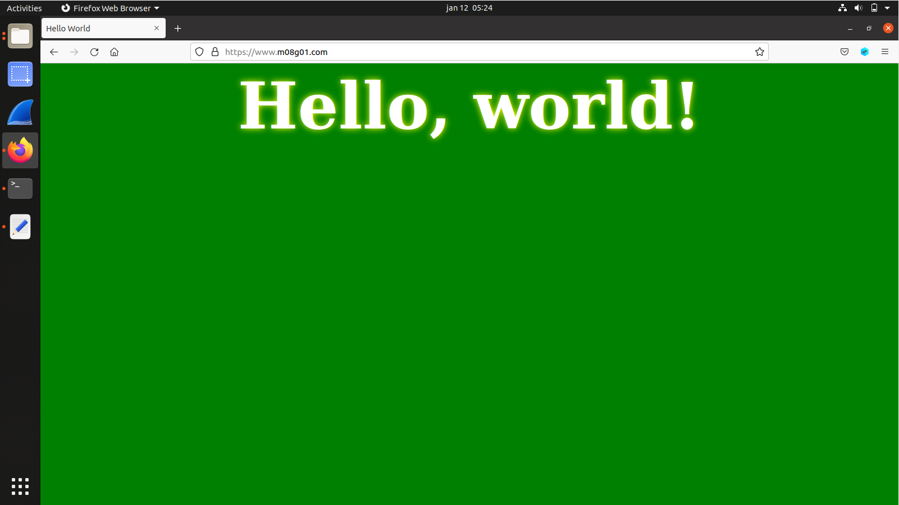
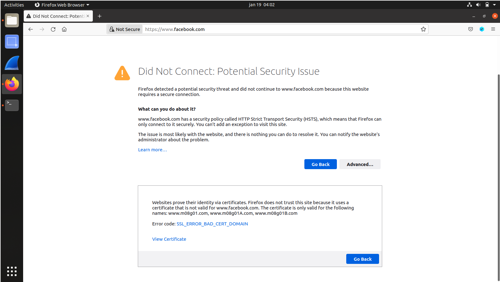
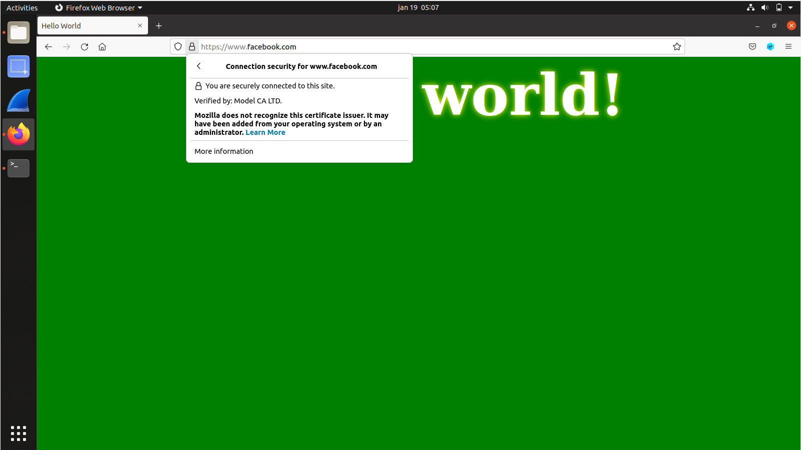

# Work developed in week 11

## **Lab Tasks**

### Task 1

The objective for the first lab task is to become a root CA and generate a CA certificate. Since we are the root CA, the certificate can be self signed.

We start by copying the `openssl.conf` file to our project folder and change some settings:

```python
[ CA_default ]
dir = ./demoCA                # Where everything is kept
certs = $dir/certs            # Where the issued certs are kept
crl_dir = $dir/crl            # Where the issued crl are kept
database = $dir/index.txt     # database index file.
unique_subject = no           # Set to ’no’ to allow creation of
# several certs with same subject.
new_certs_dir = $dir/newcerts # default place for new certs.
serial = $dir/serial          # The current serial number
```

We also create an empty `index.txt` file and a non-empty `serial` file with the number `1000`

To generate the self-signed certificate, we ran the following command:

```python
openssl req -x509 -newkey rsa:4096 -sha256 -days 3650 \
-keyout ca.key -out ca.crt \
-subj "/CN=www.modelCA.com/O=Model CA LTD./C=US" \
-passout pass:dees
```

and two files were created: `ca.key` containing the CA private key and `ca.crt` containing the public key.

We can see the contents of the `ca.crt` file with the command below:

```bash
[01/12/22]seed@VM:~/.../Labsetup$ openssl x509 -in ca.crt -text -noout
Certificate:
    Data:
        Version: 3 (0x2)
        Serial Number:
            27:d2:45:27:63:61:ec:e8:2c:f2:ee:f2:93:61:ff:d0:22:52:af:19
        Signature Algorithm: sha256WithRSAEncryption
        Issuer: CN = www.modelCA.com, O = Model CA LTD., C = US
        Validity
            Not Before: Jan 12 09:06:44 2022 GMT
            Not After : Jan 10 09:06:44 2032 GMT
        Subject: CN = www.modelCA.com, O = Model CA LTD., C = US
        Subject Public Key Info:
            Public Key Algorithm: rsaEncryption
                RSA Public-Key: (4096 bit)
                Modulus:
                    00:c2:6c:46:ba:95:37:0a:55:a8:13:b9:24:f2:c1:
                    ba:8e:93:2b:b6:94:b3:39:a8:c8:4f:f5:b6:54:cd:
                    22:96:fb:07:9c:e4:7c:40:6e:0c:79:b0:4d:5b:a3:
                    ba:e7:34:67:53:55:fd:01:29:4f:8e:23:e4:24:53:
                    1b:5a:a1:6a:c5:a5:9e:90:b1:79:ec:c1:12:b5:7f:
                    95:d2:c9:82:2c:7a:81:e5:06:4a:bc:27:10:ae:51:
                    2a:30:40:8f:99:fb:42:84:48:00:3d:c3:f5:c0:75:
                    af:7c:58:53:1d:45:f0:e5:bb:ef:dd:1d:e7:6c:7d:
                    75:a0:53:21:8d:7f:04:2b:23:9c:19:6c:b7:2c:7e:
                    87:88:be:02:7b:cb:95:4a:5d:a4:28:0c:eb:1c:25:
                    9b:23:69:61:33:4a:29:4e:72:9c:56:21:b4:3b:15:
                    3b:29:68:4d:cb:c5:93:6b:75:9e:ba:56:fc:11:39:
                    82:fc:a2:e9:18:d6:e9:95:03:71:e9:1e:40:d5:74:
                    f0:7c:15:8d:cc:5a:8a:55:43:51:2d:e3:de:4b:b3:
                    9d:67:ca:cc:77:69:32:be:61:8d:cb:e1:34:f1:de:
                    0e:41:45:0c:8b:4b:67:84:de:36:f4:c8:c5:49:5c:
                    f5:19:1e:1e:30:f6:18:6a:77:8a:e2:17:5e:f6:3e:
                    36:05:34:ba:f1:f2:8c:42:18:ce:ea:ee:5d:1b:fa:
                    8c:d2:99:e4:2d:9c:d5:1c:4d:98:1f:4d:75:2e:0e:
                    b6:1b:c8:c4:06:52:68:3d:bf:e3:49:49:67:2b:53:
                    4c:e8:d2:0e:dc:3a:75:bc:d9:e6:fa:f5:c9:1a:f7:
                    58:9a:26:52:57:d7:f5:1f:c3:0e:06:94:0a:3d:78:
                    2c:45:96:13:26:2b:4e:74:2f:98:f7:dd:55:56:d1:
                    47:7d:1e:4a:34:c3:6d:10:9a:78:0f:38:f3:07:51:
                    3d:2f:b6:fe:d2:cb:19:0f:64:9d:68:c0:37:7c:2b:
                    ba:e4:3d:7a:83:fd:52:2d:0e:25:27:0d:ee:8e:23:
                    2a:67:11:2c:5d:24:81:8f:76:ec:2c:23:1b:6f:dc:
                    c9:99:11:49:d3:c0:ed:b4:8b:46:2b:e7:c9:21:bb:
                    cc:ef:55:d0:f5:c2:16:c6:ad:b7:c3:53:06:5b:a0:
                    f4:0d:b3:26:10:a1:97:9f:5d:4b:ee:34:a9:29:51:
                    fd:b8:37:da:1f:b4:37:fb:d0:d2:61:65:2c:f2:b4:
                    35:55:ae:79:6b:ac:ba:f2:75:41:69:d7:21:b6:07:
                    64:f5:6b:b1:04:af:6a:0a:3d:c9:be:4e:f6:0f:3f:
                    0a:69:cf:a9:ca:b6:ad:33:23:91:d2:57:52:d5:c3:
                    7c:0d:ef
                Exponent: 65537 (0x10001)
        X509v3 extensions:
            X509v3 Subject Key Identifier:
                7A:73:74:69:5F:48:5B:6D:6E:9E:EA:D7:F2:06:B6:B5:D8:01:1F:9A
            X509v3 Authority Key Identifier:
                keyid:7A:73:74:69:5F:48:5B:6D:6E:9E:EA:D7:F2:06:B6:B5:D8:01:1F:9A

            X509v3 Basic Constraints: critical
                CA:TRUE
    Signature Algorithm: sha256WithRSAEncryption
         1c:5a:36:ef:9d:d1:08:18:c5:f5:e6:b5:01:0b:45:24:4f:d9:
         80:6e:f3:ef:27:79:23:04:50:5f:07:97:8a:f9:80:97:5d:cc:
         df:fa:e7:1e:91:82:22:49:69:7b:53:d5:bd:86:95:fd:b1:76:
         b2:e4:f1:26:4b:c1:b6:1a:a0:0a:d3:1b:f0:31:96:73:71:3b:
         78:6b:d0:9d:00:d0:e5:f1:1c:73:cb:95:17:67:04:f0:e2:b0:
         c8:a1:38:69:c6:bc:1b:d9:27:7d:af:59:da:c9:f5:a3:38:06:
         15:22:52:64:3c:38:1f:38:0a:d7:e6:d9:b4:93:8c:a7:23:dd:
         74:04:01:38:b0:d7:61:40:7f:13:3f:4b:21:62:14:4d:b1:04:
         25:cf:7d:77:ce:01:7a:ce:0f:ac:87:13:b1:37:3e:ec:af:82:
         4a:e2:10:69:e8:77:ea:04:af:40:47:c0:8c:96:2d:da:2e:58:
         cf:c0:48:dc:b2:e7:f6:92:59:00:b0:41:3a:a5:3b:21:c6:99:
         f0:f2:21:80:52:dc:49:ce:83:5d:a3:86:da:6a:1f:93:73:ea:
         b8:a9:7a:b3:65:c3:cc:d6:1c:0f:c5:5e:9e:dc:b0:ba:c2:14:
         35:bf:fd:61:f3:a4:8a:46:21:33:dc:01:3f:78:7d:b8:88:b0:
         2a:12:f0:2e:a1:c3:49:b1:33:bc:4f:b8:9f:67:fa:e3:04:7c:
         c2:97:10:99:56:fe:46:6a:b3:6c:dd:70:27:42:64:49:9d:25:
         4a:2e:41:63:99:5f:0f:e8:a9:10:a2:98:bc:3e:4d:47:7f:15:
         62:fa:4b:b4:08:f0:1e:7c:af:17:54:bb:58:77:1d:80:22:b2:
         f0:4b:5a:32:60:d2:03:14:bf:e3:2c:c9:4a:89:5e:85:85:d4:
         a8:9c:20:85:26:e2:82:7a:ff:d7:01:75:51:55:e0:23:f6:26:
         14:4a:9a:6a:f5:26:cb:da:65:eb:be:c2:15:7e:14:41:b4:27:
         a3:f2:0b:d1:70:ba:1d:75:41:45:b6:8f:78:d5:2d:5f:d5:9d:
         77:fb:4b:b2:24:33:1d:17:36:78:27:9d:c1:6a:83:bd:a9:0b:
         8e:21:72:98:6f:02:28:22:f1:e8:78:2a:13:ac:5a:cf:7b:28:
         49:aa:28:1e:ff:00:bb:3a:a8:8d:fd:57:13:30:00:96:2e:57:
         26:1c:4c:c8:5a:cc:6a:64:2c:c0:3b:11:1f:a6:29:f5:87:81:
         2b:f6:fe:ff:15:fb:f9:7c:f2:3a:ea:77:e3:13:91:b9:82:fb:
         ba:83:5d:7d:26:08:f6:4a:56:7b:f6:ac:c1:6e:ca:f5:a2:c6:
         26:01:20:b6:2e:73:fe:8e
```

And the same can be done for the `ca.key` file:

```bash
[01/12/22]seed@VM:~/.../Labsetup$ openssl rsa -in ca.key -text -noout
Enter pass phrase for ca.key:
RSA Private-Key: (4096 bit, 2 primes)
modulus:
    00:c2:6c:46:ba:95:37:0a:55:a8:13:b9:24:f2:c1:
    ba:8e:93:2b:b6:94:b3:39:a8:c8:4f:f5:b6:54:cd:
    22:96:fb:07:9c:e4:7c:40:6e:0c:79:b0:4d:5b:a3:
    ba:e7:34:67:53:55:fd:01:29:4f:8e:23:e4:24:53:
    1b:5a:a1:6a:c5:a5:9e:90:b1:79:ec:c1:12:b5:7f:
    95:d2:c9:82:2c:7a:81:e5:06:4a:bc:27:10:ae:51:
    2a:30:40:8f:99:fb:42:84:48:00:3d:c3:f5:c0:75:
    af:7c:58:53:1d:45:f0:e5:bb:ef:dd:1d:e7:6c:7d:
    75:a0:53:21:8d:7f:04:2b:23:9c:19:6c:b7:2c:7e:
    87:88:be:02:7b:cb:95:4a:5d:a4:28:0c:eb:1c:25:
    9b:23:69:61:33:4a:29:4e:72:9c:56:21:b4:3b:15:
    3b:29:68:4d:cb:c5:93:6b:75:9e:ba:56:fc:11:39:
    82:fc:a2:e9:18:d6:e9:95:03:71:e9:1e:40:d5:74:
    f0:7c:15:8d:cc:5a:8a:55:43:51:2d:e3:de:4b:b3:
    9d:67:ca:cc:77:69:32:be:61:8d:cb:e1:34:f1:de:
    0e:41:45:0c:8b:4b:67:84:de:36:f4:c8:c5:49:5c:
    f5:19:1e:1e:30:f6:18:6a:77:8a:e2:17:5e:f6:3e:
    36:05:34:ba:f1:f2:8c:42:18:ce:ea:ee:5d:1b:fa:
    8c:d2:99:e4:2d:9c:d5:1c:4d:98:1f:4d:75:2e:0e:
    b6:1b:c8:c4:06:52:68:3d:bf:e3:49:49:67:2b:53:
    4c:e8:d2:0e:dc:3a:75:bc:d9:e6:fa:f5:c9:1a:f7:
    58:9a:26:52:57:d7:f5:1f:c3:0e:06:94:0a:3d:78:
    2c:45:96:13:26:2b:4e:74:2f:98:f7:dd:55:56:d1:
    47:7d:1e:4a:34:c3:6d:10:9a:78:0f:38:f3:07:51:
    3d:2f:b6:fe:d2:cb:19:0f:64:9d:68:c0:37:7c:2b:
    ba:e4:3d:7a:83:fd:52:2d:0e:25:27:0d:ee:8e:23:
    2a:67:11:2c:5d:24:81:8f:76:ec:2c:23:1b:6f:dc:
    c9:99:11:49:d3:c0:ed:b4:8b:46:2b:e7:c9:21:bb:
    cc:ef:55:d0:f5:c2:16:c6:ad:b7:c3:53:06:5b:a0:
    f4:0d:b3:26:10:a1:97:9f:5d:4b:ee:34:a9:29:51:
    fd:b8:37:da:1f:b4:37:fb:d0:d2:61:65:2c:f2:b4:
    35:55:ae:79:6b:ac:ba:f2:75:41:69:d7:21:b6:07:
    64:f5:6b:b1:04:af:6a:0a:3d:c9:be:4e:f6:0f:3f:
    0a:69:cf:a9:ca:b6:ad:33:23:91:d2:57:52:d5:c3:
    7c:0d:ef
publicExponent: 65537 (0x10001)
privateExponent:
    0c:d6:27:49:54:66:c0:e8:ec:e2:f8:7b:67:07:c1:
    70:7e:69:09:72:01:ef:51:a4:80:1b:02:01:d1:55:
    72:50:7a:ad:32:2c:bd:f8:46:1c:96:b6:54:d1:97:
    9a:82:4c:3c:25:56:42:08:5f:37:4c:49:58:d8:9f:
    da:b9:03:9a:af:17:ac:07:fb:bb:d4:f7:8e:42:31:
    3b:2c:90:ca:ac:ff:fc:86:10:d3:21:65:29:8d:34:
    52:e1:40:59:f3:4b:ed:fd:ee:fe:24:fd:09:ca:fb:
    5e:23:5a:c1:79:07:b1:b3:59:df:e8:84:8a:16:32:
    78:f6:64:25:ba:78:24:fd:01:e6:6f:d6:1c:3a:f2:
    69:e5:d9:b6:20:b7:e7:a4:0d:1d:93:d4:c6:13:f9:
    8d:39:fc:ef:ec:fa:93:32:5f:fe:13:d5:99:7d:0a:
    5d:ee:84:0c:6b:2c:13:91:3d:7c:a2:17:9c:6f:86:
    a5:75:80:1c:62:bc:23:59:89:e0:d1:5d:88:7a:63:
    12:5e:3d:f1:7b:1c:dd:0a:47:c6:d6:df:ab:71:dd:
    77:a7:dd:1e:19:34:ff:7a:e3:68:cd:a2:b8:41:68:
    01:89:34:8d:d1:d9:b0:dd:17:15:cc:57:b2:43:4f:
    ef:6b:9c:a4:b0:ea:e5:c4:a4:c7:ce:b1:37:62:de:
    20:16:68:47:a5:3c:8a:45:ea:90:82:55:35:96:fe:
    d4:21:8a:65:f3:da:02:19:f0:3b:7b:c4:a9:db:5a:
    1d:7a:5e:bb:04:ff:f2:6e:6d:18:8d:68:b3:40:1d:
    48:4d:b4:28:53:fe:f4:49:b9:fb:4f:b0:37:e1:a3:
    a9:92:f5:4a:69:dc:5e:99:5d:f0:02:69:33:b3:2c:
    96:7b:85:a5:e3:b0:de:5f:0f:9c:2d:d0:25:bb:f2:
    e8:5d:31:62:8a:58:ab:4f:8c:4d:a4:ed:bf:b6:ed:
    9e:08:56:7b:b5:91:15:ed:06:f6:df:d8:2e:5e:7c:
    a5:d6:eb:5a:1b:91:7c:d5:52:cc:d4:fe:07:f2:7c:
    b6:fc:a3:ab:75:13:43:10:ce:37:78:c5:0e:ba:77:
    8d:29:f2:c9:45:b5:29:e7:21:a8:21:07:d7:ac:2e:
    bd:e6:71:d8:16:e8:44:ab:cf:63:09:9f:45:55:e2:
    06:b1:7c:ac:06:ce:ab:85:77:d4:91:06:d5:16:b7:
    44:99:dd:15:0d:30:3d:c5:ba:d0:e6:fd:d4:3a:c9:
    2c:e0:37:cc:b8:66:d3:13:21:05:6a:f7:c1:27:7c:
    64:c3:25:ce:58:24:af:38:35:e8:3b:de:bc:31:84:
    9a:a5:e0:0e:ee:7f:e8:72:c5:c6:03:bf:a8:19:88:
    04:91
prime1:
    00:e0:9c:b7:09:14:3f:d6:bd:65:37:23:49:1f:57:
    2c:18:45:08:d3:6c:cc:c7:a6:32:3d:ea:6b:11:9d:
    b8:40:73:62:d8:28:ef:81:52:27:04:cd:97:b2:ed:
    21:26:1e:4f:be:ba:2e:35:06:08:14:9a:20:65:03:
    f6:ef:84:e1:1d:29:bf:8b:35:61:92:81:2f:1a:62:
    9b:29:44:5c:1f:45:7a:38:4d:52:df:a3:52:51:96:
    eb:ee:09:1a:95:5c:70:f7:31:cb:cf:19:f7:bc:80:
    d3:97:9c:1b:08:63:fd:2b:cd:f5:18:ee:cc:49:62:
    7f:49:0d:b7:18:99:93:e3:03:0f:72:aa:7e:d9:69:
    2e:b1:a0:11:c4:0f:c3:97:ad:cb:20:01:bf:06:dc:
    4c:c1:cf:49:d2:18:c5:1c:12:65:cd:8e:78:d6:12:
    1a:61:3f:38:6e:1c:81:4d:57:16:86:84:b5:20:87:
    8e:cc:84:85:cd:4d:92:0e:67:78:89:39:29:6b:32:
    76:49:af:9c:27:76:f9:b6:28:c3:82:3c:5c:a7:65:
    74:00:8c:eb:00:c4:0d:75:f8:1b:88:92:78:35:e7:
    df:82:82:01:ec:33:ca:95:37:4d:0f:2b:46:6e:39:
    fc:05:c8:af:00:82:6a:17:12:a6:bd:a8:c7:18:70:
    64:69
prime2:
    00:dd:97:92:34:e4:21:1d:47:46:d4:c3:db:3e:d0:
    e3:3e:cb:7c:b0:53:12:e2:47:82:af:55:6b:21:4e:
    0f:5f:99:26:5c:e7:7b:4e:09:5a:ea:a8:17:83:3b:
    f6:1d:9f:d9:17:41:a9:ef:f0:eb:ae:63:d6:50:18:
    38:17:74:39:30:d6:96:f5:ba:a0:5e:e1:f8:de:27:
    c1:7e:04:3f:a4:cf:2b:8c:90:d9:f9:f2:e3:2f:21:
    5f:8b:61:7a:fc:b5:d3:fc:0a:da:16:c2:5c:fc:5e:
    d3:29:78:d7:96:67:f3:be:ff:da:6e:7b:d9:ca:9e:
    a9:41:44:54:bc:c0:25:c0:7b:b7:2e:b5:89:e7:35:
    63:99:c8:fd:88:65:7b:67:e4:f7:77:25:ca:2f:8a:
    fd:88:cf:9a:4a:be:f3:15:c5:f3:7f:d0:7a:a1:4f:
    fa:55:e8:80:2a:f4:cb:33:0e:17:87:71:cc:0f:b2:
    37:1a:f8:11:65:ca:3d:57:36:b1:d8:e9:19:aa:12:
    3c:1f:e1:ce:9c:b5:f2:6d:74:dd:61:54:25:21:42:
    34:8b:45:f6:19:62:6c:e5:f5:70:62:b9:5b:cc:c8:
    44:7f:e5:f9:5b:ca:e7:a1:2b:4b:56:b0:b0:8b:30:
    da:f9:d1:ad:93:54:52:35:5d:93:fe:24:a7:1e:ff:
    b4:97
exponent1:
    02:66:2a:1e:52:b5:0b:da:22:06:a0:bd:db:33:d7:
    28:bb:34:08:ee:14:91:dd:58:94:08:b8:f4:0b:37:
    38:99:02:e9:44:26:aa:be:f1:e3:bf:3e:6b:8e:d4:
    d7:cf:63:12:aa:72:6b:e6:90:97:87:bd:e8:d6:4e:
    00:e8:ee:6e:9d:4f:8a:71:1b:85:b1:13:8b:b8:99:
    e7:aa:ef:40:f6:41:03:f0:ef:7d:ac:04:e9:12:2f:
    9a:ef:45:f5:6a:73:5a:70:91:b8:b8:92:48:d5:27:
    6d:6b:21:6e:c9:82:9e:c1:28:69:07:c3:ee:d4:ba:
    7f:51:42:2f:65:14:8b:4c:31:12:0c:78:26:62:55:
    39:58:78:58:1b:c2:ff:0f:c0:27:ab:5d:1a:f9:a7:
    68:3a:8a:93:4f:e8:6b:10:57:3e:06:d3:8b:95:cd:
    ea:53:fe:8a:4e:8b:a3:03:d7:1d:c0:b5:1e:8f:d4:
    1a:a3:1f:ba:bd:a5:5d:ba:05:33:92:04:bb:3c:62:
    bf:0e:bd:20:3e:c9:14:05:03:71:94:ab:78:ae:40:
    ba:f0:c6:61:cf:b6:45:18:4d:52:fc:1d:84:95:e1:
    71:47:6a:35:d7:a7:c6:48:3c:ee:78:8b:dc:09:8a:
    83:95:4d:29:38:3b:61:db:b5:24:39:75:46:f1:8c:
    61
exponent2:
    55:c4:52:cc:b1:f7:b7:33:5d:51:00:b5:9d:6c:90:
    68:3f:ae:75:38:d2:38:4e:e1:60:27:b9:9d:5c:6f:
    4a:db:26:24:13:5c:80:69:d2:8c:bc:9e:cd:26:aa:
    2d:f1:2e:bf:77:a4:e4:bf:e5:18:cc:7f:a8:e4:96:
    e1:4d:14:cd:b8:61:19:9f:30:6f:49:1b:60:31:17:
    0d:45:6b:b4:c8:92:dc:87:3c:37:28:31:92:8e:62:
    42:ba:6a:35:e1:d2:b8:dd:22:68:68:b6:40:e0:1a:
    ef:14:5c:ad:54:72:dd:5c:7e:19:01:4a:dc:c7:e8:
    4e:e0:b9:c3:8c:c3:8f:ea:d2:8d:fb:a9:f2:99:91:
    81:76:6f:db:19:1c:58:ac:20:b4:37:26:38:9c:9d:
    61:14:a9:6d:80:d6:e9:78:82:b4:d7:e6:7f:05:4b:
    a9:70:a2:1a:fe:40:9f:f4:36:5b:30:4a:81:50:c3:
    4f:66:f0:a4:eb:50:2e:af:76:ca:b3:fe:40:fb:69:
    d6:15:3a:39:21:9b:41:8e:58:19:51:ce:45:3f:30:
    c3:2f:42:ff:b4:3e:de:0a:cf:83:06:a7:67:6d:a4:
    45:b4:a7:7d:45:dd:bd:5d:da:7d:25:4a:4f:b5:8b:
    2b:e2:62:42:82:02:87:b1:3e:94:c1:6f:05:ea:86:
    e5
coefficient:
    00:9c:4a:26:bf:08:5d:70:2f:94:c7:52:49:43:8c:
    04:97:1d:3b:a7:5f:66:ca:e5:5c:8d:ec:df:61:d0:
    d6:7b:c2:d3:4c:0c:ba:fa:c9:3c:08:a6:19:7f:d4:
    94:df:f9:6a:0e:8a:56:05:22:c6:70:b3:da:12:04:
    6d:49:fe:de:25:73:1b:53:77:f5:ac:22:7e:80:bb:
    a1:33:f6:4c:d6:65:d7:d9:06:15:b6:d8:e2:7e:c1:
    58:36:1b:c1:2c:7d:35:3d:2e:a6:b3:ee:c6:6d:ab:
    19:16:18:2f:b5:ea:35:35:1d:46:e3:6d:1a:72:34:
    18:7e:67:60:66:bf:35:9a:4c:21:e9:61:78:03:ec:
    60:f2:2c:c1:f7:61:a6:60:c5:a0:dc:44:f9:49:d9:
    81:fb:08:7d:e7:27:70:b8:f4:25:9a:c4:f1:c2:fd:
    06:19:7f:ba:8b:fa:3b:6f:27:dd:59:1f:8f:64:93:
    83:14:99:70:a9:33:76:06:ba:b8:a8:8b:57:ea:0c:
    d0:fd:f5:29:35:bb:4a:d3:50:7e:1a:4c:f8:2c:1e:
    a0:55:fb:48:bd:6a:a0:db:ef:c9:52:2b:ce:de:34:
    94:ac:11:2a:29:a8:47:b9:2e:86:31:f5:8d:01:0f:
    6c:06:2b:5c:a3:1d:7a:c5:6f:79:d9:62:61:b6:ef:
    e5:cc
```

Next, we need to answer the following questions:

> What part of the certificate indicates this is a CA’s certificate?

```ocaml
X509v3 extensions:
    X509v3 Subject Key Identifier:
        7A:73:74:69:5F:48:5B:6D:6E:9E:EA:D7:F2:06:B6:B5:D8:01:1F:9A
    X509v3 Authority Key Identifier:
        keyid:7A:73:74:69:5F:48:5B:6D:6E:9E:EA:D7:F2:06:B6:B5:D8:01:1F:9A

    X509v3 Basic Constraints: critical
        CA:TRUE
```

From the `ca.cert` file, there’s a flag signaled as true that indicates that is a CA’s certificate: `CA:TRUE`.

> What part of the certificate indicates this is a self-signed certificate?

The `Subject Key Identifier` is equal to the `Authority Key Identifier`.

> In the RSA algorithm, we have a public exponent e, a private exponent d, a modulus n, and two secret numbers p and q, such that n = pq. Please identify the values for these elements in your certificate and key files.

All of those numbers can be seen in the `ca.key` file:

```
modulus           INTEGER,  -- n
publicExponent    INTEGER,  -- e
privateExponent   INTEGER,  -- d
prime1            INTEGER,  -- p
prime2            INTEGER,  -- q
exponent1         INTEGER,  -- d mod (p-1)
exponent2         INTEGER,  -- d mod (q-1)
coefficient       INTEGER,  -- (inverse of q) mod p
```

```bash
[01/12/22]seed@VM:~/.../Labsetup$ openssl rsa -in ca.key -text -noout
Enter pass phrase for ca.key:
RSA Private-Key: (4096 bit, 2 primes)
modulus:
    00:c2:6c:46:ba:95:37:0a:55:a8:13:b9:24:f2:c1:
    (...)
publicExponent: 65537 (0x10001)
privateExponent:
    0c:d6:27:49:54:66:c0:e8:ec:e2:f8:7b:67:07:c1:
    (...)
prime1:
    00:e0:9c:b7:09:14:3f:d6:bd:65:37:23:49:1f:57:
		(...)
prime2:
    00:dd:97:92:34:e4:21:1d:47:46:d4:c3:db:3e:d0:
    (...)
exponent1:
    02:66:2a:1e:52:b5:0b:da:22:06:a0:bd:db:33:d7:
		(...)
exponent2:
    55:c4:52:cc:b1:f7:b7:33:5d:51:00:b5:9d:6c:90:
    (...)
coefficient:
    00:9c:4a:26:bf:08:5d:70:2f:94:c7:52:49:43:8c:
    (...)
```

### Task 2

Since we now have the ability to certificate other companies, we simulated a company called `www.m08g01.com`. In this task we generate a certificate request for this web server, and to do that we need to generate a Certificate Signing Request (CSR). The request is very similar to the one we used in the previous task, but without the -x509 option it will generate a request instead of generating a self-signed certificate.

```bash
openssl req -newkey rsa:2048 -sha256 \
-keyout server.key -out server.csr \
-subj "/CN=www.m08g01.com/O=M08G01/C=PT" \
-passout pass:dees \
-addext "subjectAltName = DNS:www.m08g01.com, \
DNS:www.m08g01A.com, \
DNS:www.m08g01B.com"
```

For the command above we also add the `subjectAltName` field, which allows a certificate to have multiple names. The output of the command stored in the files **server.key** and **server.crt** the CA’s private key and the certificate signing request, respectively, which will be used in the next task to generate a certificate for this server.

The following command show us the content of the Certificate Signing Request present in the `server.csr` file:

```bash
[01/12/22]seed@VM:~/.../Labsetup$ openssl req -in server.csr -text -noout
Certificate Request:
    Data:
        Version: 1 (0x0)
        Subject: CN = www.m08g01.com, O = M08G01, C = PT
        Subject Public Key Info:
            Public Key Algorithm: rsaEncryption
                RSA Public-Key: (2048 bit)
                Modulus:
                    00:ae:27:ee:36:02:8d:a8:4c:60:cb:4e:c4:02:81:
                    fd:81:7f:f4:7e:8f:94:16:66:4a:4b:fa:6a:1c:52:
                    4e:5d:9d:38:e7:45:03:bb:16:8a:74:9b:6a:13:35:
                    f4:95:30:ec:9a:38:4e:0b:0e:ec:e1:3f:f3:8b:51:
                    d4:a8:6a:24:fc:1c:9e:2f:6f:c6:8c:fb:fe:d7:0b:
                    95:a8:f7:e4:cd:c3:90:71:83:62:0d:84:d9:cf:a3:
                    b9:8c:50:78:4e:fb:0d:79:dd:1f:c2:52:87:2c:50:
                    79:cb:23:87:98:ff:86:bb:5f:45:17:4f:09:b5:2d:
                    fa:1d:60:f4:f8:ef:a8:db:ec:3e:fc:4d:f0:04:db:
                    82:e3:f0:d7:6f:c2:da:30:c1:f7:50:f0:76:f4:4e:
                    95:86:e2:11:cd:92:51:08:e0:5d:09:69:fd:da:c6:
                    5b:f1:f2:4c:68:07:e0:da:0f:61:be:8c:80:3d:a9:
                    1e:a4:46:bc:a7:e2:77:b0:3e:28:7f:ed:95:a5:09:
                    df:fd:47:a2:ae:87:20:49:4d:0e:35:79:fc:be:09:
                    2e:23:3a:8e:e5:10:2a:78:81:e0:73:22:58:d5:41:
                    c0:e1:df:bd:d0:75:ed:f2:a0:5c:fd:1b:f5:e2:b0:
                    f9:f8:05:91:ab:9c:99:33:29:98:ab:5f:83:64:da:
                    85:29
                Exponent: 65537 (0x10001)
        Attributes:
        Requested Extensions:
            X509v3 Subject Alternative Name:
                DNS:www.m08g01.com, DNS:www.m08g01A.com, DNS:www.m08g01B.com
    Signature Algorithm: sha256WithRSAEncryption
         51:7b:76:2d:53:08:36:49:98:46:e4:ea:9f:99:44:0a:bf:91:
         3e:b6:4c:44:fa:d9:1d:90:05:8e:93:18:ea:2a:a3:7d:21:fb:
         16:5f:8c:d7:ff:ef:5b:07:2f:b9:07:80:5d:2b:fb:12:8a:be:
         da:fe:ad:7b:a9:b2:1e:1e:00:c6:5e:0b:6c:22:49:93:f8:0b:
         f5:9b:cf:7c:86:4a:42:7b:36:06:e9:78:ac:4d:68:aa:08:3e:
         21:f2:f8:2e:d0:d9:60:9d:e7:8e:c2:cc:5a:b4:1b:f4:45:85:
         36:ee:9f:27:01:13:e0:e6:c7:64:a2:27:bd:48:ea:09:1a:36:
         5a:80:8c:e4:55:83:47:ca:9a:66:86:85:fb:aa:3c:67:16:3d:
         f5:b9:2c:c5:3b:fb:c1:d3:09:38:08:af:36:33:84:ee:f7:c6:
         6b:cc:f1:85:1f:de:63:62:95:39:53:37:2e:78:6e:be:90:5d:
         8d:da:8a:3b:c4:8b:76:ef:3c:ad:00:6e:6f:95:27:c8:7b:5b:
         52:09:b2:d3:73:3b:50:9f:66:7f:c5:14:39:79:50:ac:b1:c7:
         d4:22:da:8b:20:7f:d4:5c:03:44:6a:d0:7f:78:e7:e0:c5:83:
         0f:7d:95:ef:82:4f:0d:6f:89:ea:10:fe:c9:33:4d:5b:d0:cc:
         d2:5b:a2:55
```

And we can also see the CA’s private key with the command below, present in the `server.key` file:

```bash
[01/12/22]seed@VM:~/.../Labsetup$ openssl rsa -in server.key -text -noout
Enter pass phrase for server.key:
RSA Private-Key: (2048 bit, 2 primes)
modulus:
    00:ae:27:ee:36:02:8d:a8:4c:60:cb:4e:c4:02:81:
    fd:81:7f:f4:7e:8f:94:16:66:4a:4b:fa:6a:1c:52:
    4e:5d:9d:38:e7:45:03:bb:16:8a:74:9b:6a:13:35:
    f4:95:30:ec:9a:38:4e:0b:0e:ec:e1:3f:f3:8b:51:
    d4:a8:6a:24:fc:1c:9e:2f:6f:c6:8c:fb:fe:d7:0b:
    95:a8:f7:e4:cd:c3:90:71:83:62:0d:84:d9:cf:a3:
    b9:8c:50:78:4e:fb:0d:79:dd:1f:c2:52:87:2c:50:
    79:cb:23:87:98:ff:86:bb:5f:45:17:4f:09:b5:2d:
    fa:1d:60:f4:f8:ef:a8:db:ec:3e:fc:4d:f0:04:db:
    82:e3:f0:d7:6f:c2:da:30:c1:f7:50:f0:76:f4:4e:
    95:86:e2:11:cd:92:51:08:e0:5d:09:69:fd:da:c6:
    5b:f1:f2:4c:68:07:e0:da:0f:61:be:8c:80:3d:a9:
    1e:a4:46:bc:a7:e2:77:b0:3e:28:7f:ed:95:a5:09:
    df:fd:47:a2:ae:87:20:49:4d:0e:35:79:fc:be:09:
    2e:23:3a:8e:e5:10:2a:78:81:e0:73:22:58:d5:41:
    c0:e1:df:bd:d0:75:ed:f2:a0:5c:fd:1b:f5:e2:b0:
    f9:f8:05:91:ab:9c:99:33:29:98:ab:5f:83:64:da:
    85:29
publicExponent: 65537 (0x10001)
privateExponent:
    0a:4f:82:e2:df:b3:d3:4a:f2:50:17:11:b3:b4:4e:
    75:e4:45:6d:58:c2:c3:b0:ba:a5:54:e6:03:57:3c:
    1c:7e:ba:67:b6:c6:49:c5:43:dd:33:76:4c:3c:dd:
    86:17:a7:6a:59:fb:04:dc:95:59:a0:97:a2:9f:ed:
    9f:2a:e9:95:a3:7c:1a:02:dc:16:6c:b4:e1:b6:65:
    dd:e3:0f:40:bf:5b:45:dd:29:68:f3:7c:91:b6:77:
    bd:be:e5:e0:87:2c:7d:12:82:56:d6:db:f9:db:a9:
    da:44:f8:3a:2e:a6:a3:61:38:8d:f0:b7:fa:6a:06:
    6c:c6:d8:ba:04:36:53:0e:c8:89:da:86:64:cd:8c:
    79:0b:12:4d:ab:91:02:4f:44:ab:46:c3:09:11:92:
    34:43:25:7b:4b:9f:98:80:03:5b:a4:4b:b4:4a:b2:
    39:bf:26:1b:e8:e0:14:7b:65:c9:25:4b:dc:cb:85:
    a6:89:65:7e:e7:ba:cc:cc:5e:3b:de:71:db:c9:44:
    f8:b9:df:9a:50:10:42:42:bf:aa:5c:d0:98:00:a7:
    57:eb:dc:22:04:55:05:fc:21:2a:89:54:ef:65:43:
    e5:13:30:5a:98:ea:03:3d:8c:6f:1a:d6:db:a7:be:
    ec:18:52:87:36:f5:30:a6:69:16:0c:23:49:2c:a1:
    21
prime1:
    00:d7:d1:c1:96:13:34:ab:c1:6f:a4:9e:c6:39:e1:
    5b:cd:53:71:4d:b1:24:2c:2b:1c:c4:f5:eb:9a:44:
    38:f3:12:37:ed:69:7d:0a:17:f4:14:f2:df:e4:f2:
    f8:ba:25:6a:09:ed:19:65:0a:48:91:dc:df:06:5b:
    36:5a:f9:2e:31:35:69:d0:39:fa:6e:53:6d:8a:39:
    14:4c:c4:2f:ed:fc:52:e2:83:41:ad:04:f3:fc:80:
    54:5c:2a:aa:ef:02:89:a3:f0:4c:fc:46:39:5f:34:
    38:f2:35:f5:14:d7:68:ba:ea:d1:25:24:ad:03:71:
    49:5c:fa:db:9b:51:3d:e0:df
prime2:
    00:ce:94:70:e3:39:b4:7a:db:46:ea:74:3a:78:55:
    b6:fd:7b:f3:65:72:5d:ec:67:8e:d1:6e:8a:05:24:
    be:e9:75:e6:19:60:80:4f:f9:92:8c:3c:be:ae:7c:
    3c:82:59:97:4f:a5:0e:3e:7a:e9:d7:e7:2b:f9:36:
    ff:af:6c:93:34:41:7f:49:2a:4e:3d:0d:87:bb:ea:
    04:e6:94:e2:ef:4b:ec:2d:80:17:3a:b1:1a:21:ad:
    26:2e:dc:9f:90:4e:9d:81:13:f1:68:7b:5f:9e:4e:
    01:09:e0:89:30:d8:b3:c1:2c:65:9a:7a:b2:97:e5:
    00:d8:29:92:99:14:25:32:f7
exponent1:
    2b:c0:84:44:4e:64:71:25:67:e2:b1:a5:71:fa:73:
    c7:ee:50:9b:f5:7b:65:d0:df:a6:36:4c:ab:1b:85:
    88:11:7b:71:0f:df:9f:7a:37:ab:3f:89:90:3a:89:
    9e:03:13:ba:2b:6c:e8:84:eb:2d:56:df:87:c4:5a:
    02:9b:5d:77:f0:62:21:2a:7f:d0:79:ed:4d:06:41:
    4d:46:c0:88:b8:8c:7d:0b:2a:f7:4e:77:c0:0a:ac:
    0f:7b:3e:e7:f1:55:c1:fc:67:3f:05:65:80:1d:70:
    25:fa:36:53:21:50:44:04:72:9d:db:0f:90:11:19:
    54:56:2e:cb:0f:ef:41:75
exponent2:
    5f:ef:39:b9:9c:5b:bf:4e:43:d1:af:a6:53:a9:e2:
    b0:37:36:e2:5e:c9:55:77:06:31:26:77:7c:4a:03:
    4a:e2:10:b8:aa:43:0c:60:e7:78:ae:e1:12:a0:e9:
    6c:d3:74:5c:6d:57:7f:16:8f:b0:4f:4f:f1:8d:64:
    12:30:86:f0:16:96:a9:00:b7:92:cc:cc:c3:2c:bb:
    97:e5:7e:ba:08:75:26:f0:3c:59:6a:53:ab:5e:00:
    c4:74:7a:b9:86:78:c8:af:dd:45:5b:3e:1d:83:36:
    22:43:1f:13:0b:1f:f7:4e:c9:e4:82:a4:9b:bb:a2:
    b7:c0:1e:af:6e:56:94:23
coefficient:
    2d:6b:37:48:32:70:03:9e:4d:76:b6:dd:c6:2f:c3:
    59:aa:42:52:bc:05:e5:6d:1e:8c:c2:3a:d9:2f:9e:
    2f:ec:c3:5e:25:9e:4e:1e:2d:e2:ec:89:66:a0:16:
    2d:a6:e9:44:3f:36:c6:61:2d:50:51:9a:d7:88:83:
    c0:30:70:79:fe:6a:9c:49:9f:fc:c2:a4:76:d6:80:
    d6:5b:af:d6:0f:f8:b0:66:91:2d:b5:06:e2:c3:9c:
    a0:c5:2a:2d:e8:e2:3b:26:6e:d0:0a:af:e6:53:fa:
    52:7a:a6:2e:01:6b:16:c6:44:40:f3:ad:00:f4:cb:
    19:83:0b:63:6b:00:b5:7b
```

### Task 3

Now we need to create a X509 certificate from the `server.csr` file. To do that, we can run the following command:

```bash
openssl ca -config myCA_openssl.cnf -policy policy_anything \
-md sha256 -days 3650 \
-in server.csr -out server.crt -batch \
-cert ca.crt -keyfile ca.key
```

Which creates a `server.crt`, signed by the CA, that originated from the `server.csr`.

Then we can run `openssl x509 -in server.crt -text -noout` and we get the following result:

```yaml
[01/12/22]seed@VM:~/.../Labsetup$ openssl x509 -in server.crt -text -noout
Certificate:
    Data:
        Version: 3 (0x2)
        Serial Number: 4097 (0x1001)
        Signature Algorithm: sha256WithRSAEncryption
        Issuer: CN = www.modelCA.com, O = Model CA LTD., C = US
        Validity
            Not Before: Jan 19 09:44:18 2022 GMT
            Not After : Jan 17 09:44:18 2032 GMT
        Subject: C = PT, O = M08G01, CN = www.m08g01.com
        Subject Public Key Info:
            Public Key Algorithm: rsaEncryption
                RSA Public-Key: (2048 bit)
                Modulus:
                    00:e4:cc:3a:c3:14:bd:c0:6a:eb:bc:98:2b:d5:df:
                    84:5b:c3:a6:87:ee:ef:4d:ab:4a:c3:b1:e5:72:3e:
                    4c:61:bb:f7:46:79:a6:43:0f:f3:ab:36:bf:b2:cb:
                    79:25:13:69:a3:ca:bd:3b:67:cc:45:ef:ab:44:30:
                    a2:4a:86:ea:8a:2f:09:42:35:61:13:6c:15:4d:42:
                    07:31:a4:3f:b8:99:34:83:a4:c3:13:09:3a:b1:a4:
                    60:41:27:9e:cf:e2:c5:93:75:51:ca:fe:dc:3a:1b:
                    b5:94:6f:04:38:3a:a3:61:96:0b:41:3a:bc:81:84:
                    a4:6a:e4:02:32:1b:16:c4:0b:14:e1:85:2c:30:e6:
                    45:cc:a5:42:84:ef:c9:05:8e:ed:ad:ca:06:cb:28:
                    6b:ba:dd:c7:17:f0:c9:72:52:83:49:1b:d1:9a:2c:
                    fd:03:67:da:e0:56:74:79:bb:cc:52:df:f2:80:83:
                    7c:b2:f8:b4:63:44:20:b1:a3:ca:95:74:fd:fc:c2:
                    02:a1:48:f8:ab:fd:55:20:a8:13:1d:d3:5b:56:f3:
                    e9:94:49:86:ca:84:f4:43:0d:ca:40:57:22:a9:1f:
                    de:e3:30:56:cd:06:fc:0b:9e:0a:f5:f0:d0:45:fe:
                    20:47:4d:d3:4a:00:8f:40:13:ee:c8:83:b6:46:a7:
                    35:f1
                Exponent: 65537 (0x10001)
        X509v3 extensions:
            X509v3 Basic Constraints:
                CA:FALSE
            Netscape Comment:
                OpenSSL Generated Certificate
            X509v3 Subject Key Identifier:
                ED:5B:96:AC:C6:65:92:4D:2F:DE:33:AD:F1:6E:BC:03:CA:76:1B:06
            X509v3 Authority Key Identifier:
                keyid:7A:73:74:69:5F:48:5B:6D:6E:9E:EA:D7:F2:06:B6:B5:D8:01:1F:9A

            X509v3 Subject Alternative Name:
                DNS:www.m08g01.com, DNS:www.m08g01A.com, DNS:www.m08g01B.com
    Signature Algorithm: sha256WithRSAEncryption
         ab:f6:f7:62:48:c5:74:72:17:cd:af:d8:00:76:ba:65:0f:80:
         96:f4:f7:1e:51:ff:25:95:86:ba:f9:35:cc:7f:04:b8:10:cc:
         06:29:cb:27:9a:0c:f2:67:d7:34:ef:f2:82:db:17:14:c6:42:
         ba:ef:78:55:ff:28:d6:5f:37:fd:68:e0:76:27:95:cd:a5:8b:
         78:f1:a6:4b:4b:b8:37:2d:5a:11:a3:37:95:1e:f8:14:de:39:
         93:bb:ed:e1:c5:2b:8f:1a:db:df:68:5f:f5:61:e4:0d:67:4b:
         f9:eb:95:b4:6a:0e:ee:3f:b2:95:fb:da:d2:ac:cd:85:d0:83:
         90:8f:f9:0b:e3:be:58:72:15:fd:a5:66:25:ea:9b:38:21:19:
         8f:9e:19:eb:61:06:96:c8:69:03:e9:f5:a0:41:59:fc:6a:c3:
         f5:34:16:a7:c0:3e:4b:ad:31:41:6f:5c:17:85:97:e5:75:da:
         da:fa:c3:e6:2f:24:aa:5b:8e:30:95:f5:e3:01:ed:f7:cd:14:
         37:15:4c:fd:77:bd:da:b8:f2:8b:24:51:b7:0d:fb:52:2a:64:
         b8:fe:bc:32:0a:07:42:75:b6:f1:a3:6c:b8:f9:c8:77:b5:f4:
         ca:e6:c0:c4:ea:38:80:03:f2:8e:f2:f3:56:2f:6e:1a:ba:c7:
         34:f6:3d:ff:17:19:a1:ec:60:ac:30:cb:a1:e2:b3:6f:bb:8a:
         d0:fc:b6:46:9b:b1:a8:f4:b7:31:bb:f2:6b:53:a4:bc:f9:9f:
         52:e5:84:b3:d1:bc:36:4a:03:b2:72:3c:ed:c3:89:e2:ae:0f:
         07:df:e4:6d:59:e1:94:e1:f1:ff:97:99:ee:b3:c9:9d:eb:08:
         63:da:db:eb:da:8e:91:f8:8a:e9:56:94:44:9f:1d:e4:0c:22:
         0d:16:1d:af:6c:1c:31:7d:4f:c9:c8:70:3b:9c:e2:98:b2:da:
         5a:4e:6e:a0:ae:a5:e2:dc:34:cc:06:a2:7d:33:ef:6a:41:59:
         b0:28:5c:32:5d:e1:e5:74:15:b2:23:6e:b8:f6:79:fa:c4:ff:
         0a:ff:f7:dc:ca:be:a6:1a:c4:ea:e9:ea:16:b9:73:d9:6b:7c:
         2d:6e:20:9b:16:56:e2:c6:a5:12:9c:b4:19:f8:09:30:51:31:
         28:d2:75:9f:ae:06:37:18:a5:ae:ec:a5:2a:9f:74:2a:89:e5:
         92:c3:88:ef:ad:74:43:54:1c:f7:53:1b:59:d8:95:0d:2a:95:
         b9:e2:a0:9b:89:5b:72:a1:ef:73:86:54:c2:5e:f2:67:32:cb:
         b8:33:ad:50:e7:a6:69:96:9d:f7:63:af:67:67:99:ca:29:0e:
         49:01:0c:ed:27:c7:ab:f3
```

From the certificate data, we can check that the alternative names were indeed included:

```yaml
X509v3 Subject Alternative Name: DNS:www.m08g01.com, DNS:www.m08g01A.com, DNS:www.m08g01B.com
```

### Task 4

In this task we set up an HTTPS website based on Apache using the certificate generated in the previous tasks to secure web browsing. To do that we needed to configure the Apache server, so it knows where to get the private key and certificate.

We start by moving the files generated in the previous task (`server.crt` and `server.key`) into the `/certs` folder of the container.

```bash
[01/12/22]seed@VM:~/.../image_www$ tree
.
├── bank32_apache_ssl.conf
├── certs
│   ├── bank32.crt
│   ├── bank32.key
│   ├── modelCA.crt
│   ├── README.txt
│   ├── server.crt
│   ├── server.csr
│   └── server.key
├── Dockerfile
├── index.html
├── index_red.html
└── m08g01_apache_ssl.conf
```

And as we can see, the Apache server can know the directory where the website’s files are stored through is `VirtualHost` entry, located in a file `m08g01_apache_ssl.conf` in our container:

```yaml
[01/12/22]seed@VM:~/.../image_www$ cat m08g01_apache_ssl.conf
<VirtualHost *:443>
    DocumentRoot /var/www/m08g01
    ServerName www.m08g01.com
    ServerAlias www.m08g01A.com
    ServerAlias www.m08g01B.com
    DirectoryIndex index.html
    SSLEngine On
    SSLCertificateFile /certs/server.crt
    SSLCertificateKeyFile /certs/server.key
</VirtualHost>

<VirtualHost *:80>
    DocumentRoot /var/www/m08g01
    ServerName www.m08g01.com
    DirectoryIndex index_red.html
</VirtualHost>

# Set the following gloal entry to suppress an annoying warning message
ServerName localhost
```

```bash
[01/12/22]seed@VM:~/.../image_www$ cat Dockerfile
FROM handsonsecurity/seed-server:apache-php

ARG WWWDIR=/var/www/m08g01

COPY ./index.html ./index_red.html $WWWDIR/
COPY ./m08g01_apache_ssl.conf /etc/apache2/sites-available
COPY ./certs/server.crt ./certs/server.key  /certs/

RUN  chmod 400 /certs/server.key \
     && chmod 644 $WWWDIR/index.html \
     && chmod 644 $WWWDIR/index_red.html \
     && a2ensite m08g01_apache_ssl

CMD  tail -f /dev/null
```

We can then start the docker containers and start the apache server using the container’s bash:

`service apache2 start`.

When we enter the website, a security error appears, this can be passed by adding the Certificate Authority certificate as a valid CA for this website, via the `about:preferences#privacy` in the Firefox’s settings., resulting in the page below, where the browser does not find any security errors (the padlock in the left of the URL is closed)



### Task 5

For this task we will simulate a MITM attack. First, we choose our target website, which will be `[facebook.com](http://facebook.com)` and we need to change our server configuration file to host our website in this URL:

```bash
[01/12/22]seed@VM:~/.../image_www$ cat m08g01_apache_ssl.conf
<VirtualHost *:443>
    DocumentRoot /var/www/m08g01
    ServerName www.facebook.com
    ServerAlias www.facebookA.com
    ServerAlias www.facebookB.com
    DirectoryIndex index.html
    SSLEngine On
    SSLCertificateFile /certs/server.crt
    SSLCertificateKeyFile /certs/server.key
</VirtualHost>

<VirtualHost *:80>
    DocumentRoot /var/www/m08g01
    ServerName www.facebook.com
    DirectoryIndex index_red.html
</VirtualHost>

# Set the following gloal entry to suppress an annoying warning message
ServerName localhost
```

Next, we will make a DNS-based attack, and to do this, we simply change the DNS on the victims machine to point to our server’s IP address when accessing the target website:

- Change `/etc/hosts` → add `10.9.0.80 [www.facebook.com](http://www.facebook.com/)`

After this, when we enter the website, we get a security warning. This happens because our certificates are not valid for `facebook.com`, only for the URL’s we worked with in the previous tasks



### Task 6

In this task, we need to redo the steps from the previous tasks, in order to have a valid certificate for _facebook.com_ and the browser not alerting the user about any security issue. So first we create a certificate request for our new website of choice:

```bash
openssl req -newkey rsa:2048 -sha256 \
-keyout server.key -out server.csr \
-subj "/CN=www.facebook.com/O=M08G01/C=PT" \
-passout pass:dees \
-addext "subjectAltName = DNS:www.facebook.com, \
DNS:www.facebookA.com, \
DNS:www.facebookB.com"
```

And with our root CA, provide a certificate for this request:

```bash
openssl ca -config myCA_openssl.cnf -policy policy_anything \
-md sha256 -days 3650 \
-in server.csr -out server.crt -batch \
-cert ca.crt -keyfile ca.key
```

After running the containers, the browser allows the user to access the website without problems. Only a message is printed by Firefox, since it does not recognize the CA.


